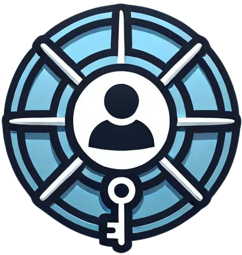

<h1 style="display: flex; flex-direction: column; align-items: center; gap: 30px;">
  
  Kubernetes Access Manager (KAM)
  
</h1>

---
## For English Press [Here](#introduction) / Для русского нажмите [здесь](#введение)

---
## Opis

Aplikacja **Kubernetes Access Manager (KAM)** pomaga rozwiązać problem braku elastyczności w zarządzaniu dostępem do 
klastrów Kubernetes. Dzięki precyzyjnemu przypisywaniu uprawnień na podstawie przestrzeni nazw (namespace) i typów 
zasobów (resource), KAM upraszcza zarządzanie klastrami i zwiększa bezpieczeństwo.

Zintegrowana z systemami zarządzania tożsamością, takimi jak Keycloak, aplikacja wykorzystuje standard OpenID Connect 
(OIDC), zapewniając łatwą autoryzację i uwierzytelnianie.

---

## Najważniejsze funkcje

- **Zarządzanie zasobami Kubernetes**: Tworzenie, edycja, usuwanie.
- **Przegląd zasobów**:
    - Wyświetlanie listy zasobów.
    - Szczegółowe informacje o zasobach i aplikacjach helmowych.
- **Rollback aplikacji helmowych**: Przywracanie wcześniejszych wersji.
- **Zarządzanie dostępem**:
    - 5 poziomów uprawnień:
        - Widok listy.
        - Widok szczegółowy.
        - Tworzenie.
        - Edycja.
        - Usuwanie.
- **Integracja z Keycloak**: Łatwa autoryzacja i uwierzytelnianie.
- **Intuicyjny interfejs webowy**: Dostosowany do użytkowników o różnym poziomie zaawansowania.
- **Prosta instalacja**: Możliwość wdrożenia w Kubernetes za pomocą Helm Chart.

---

## Jak zacząć?

Podążaj zgodnie z instrukcją [tutaj](./path/to/quickstart.md)

---

## Dokumentacja
*Dokumentacja jest wciąż w procesie tworzenia*

- [Quickstart](./path/to/quickstart.md)

---

## Autorzy

- **Vera Goriukhina** – [@vgoriukhina](https://github.com/vgoriukhina)
- **Marek Fiuk** – [@Nightbaka](https://github.com/Nightbaka)
- **Dawid Walkiewicz** – [@Ninja00Shadow](https://github.com/Ninja00Shadow)
- **Samuel Żołądz** – [@samuelus](https://github.com/samuelus), [@SamuelZoladz](https://github.com/SamuelZoladz)

Jeśli masz pytania lub sugestie, skontaktuj się z nami poprzez
[issues](https://github.com/ZPI-2024-25/KubernetesAccessManager/issues).

Projekt został zrealizowany w ramach kursu **Zespołowe przedsięwzięcie inżynierskie** na Politechnice Wrocławskiej pod 
nadzorem prowadzących: 
- **mgr inż. Piotr Jóźwiak**
- **dr hab. inż. Ireneusz Jóźwiak**

---

## Licencja

Projekt jest dostępny na licencji MIT. Szczegóły w pliku [LICENSE](./LICENSE).

---

## Introduction

The **Kubernetes Access Manager (KAM)** application addresses the lack of flexibility in managing access to Kubernetes clusters. By assigning precise permissions based on namespaces and resource types, KAM simplifies cluster management and enhances security.

Integrated with identity management systems like Keycloak, the application utilizes the OpenID Connect (OIDC) standard to provide seamless authorization and authentication.

---

## Key Features

- **Kubernetes Resource Management**: Create, edit, delete resources.
- **Resource Overview**:
    - Display resource lists.
    - Detailed information about resources and Helm applications.
- **Helm Application Rollback**: Restore previous versions.
- **Access Management**:
    - 5 levels of permissions:
        - View list.
        - Detailed view.
        - Create.
        - Edit.
        - Delete.
- **Integration with Keycloak**: Simple authorization and authentication.
- **Intuitive Web Interface**: Designed for users with varying levels of expertise.
- **Simple Installation**: Deployable in Kubernetes using a Helm Chart.

---

## Getting Started

Follow the instructions [here](./path/to/quickstart.md).

---

## Documentation
*The documentation is still in progress.*

- [Quickstart](./path/to/quickstart.md)

---

## Authors

- **Vera Goriukhina** – [@vgoriukhina](https://github.com/vgoriukhina)
- **Marek Fiuk** – [@Nightbaka](https://github.com/Nightbaka)
- **Dawid Walkiewicz** – [@Ninja00Shadow](https://github.com/Ninja00Shadow)
- **Samuel Żołądz** – [@samuelus](https://github.com/samuelus), [@SamuelZoladz](https://github.com/SamuelZoladz)

If you have questions or suggestions, feel free to contact us via [issues](https://github.com/ZPI-2024-25/KubernetesAccessManager/issues).

The project was developed under the supervision of the instructors of the **Team Engineering Project** course at Wrocław University of Science and Technology:
- **MSc. Eng. Piotr Jóźwiak**
- **Prof. Ireneusz Jóźwiak, DSc. Eng.**

---

## License

The project is available under the MIT license. Details in the [LICENSE](./LICENSE) file.

---

## Введение

Приложение **Kubernetes Access Manager (KAM)** помогает решить проблему недостаточной гибкости при управлении доступом
к кластерам Kubernetes. Благодаря точному распределению прав доступа на основе пространств имен (namespace) и типов
ресурсов (resource), KAM упрощает управление кластерами и повышает уровень безопасности.

Интеграция с системами управления идентификацией, такими как Keycloak, использует стандарт OpenID Connect (OIDC),
обеспечивая удобную авторизацию и аутентификацию.

---

## Основные функции

- **Управление ресурсами Kubernetes**: Создание, редактирование, удаление.
- **Просмотр ресурсов**:
    - Отображение списка ресурсов.
    - Детальная информация о ресурсах и helm-приложениях.
- **Откат helm-приложений**: Восстановление предыдущих версий.
- **Управление доступом**:
    - 5 уровней прав доступа:
        - Просмотр списка.
        - Просмотр деталей.
        - Создание.
        - Редактирование.
        - Удаление.
- **Интеграция с Keycloak**: Удобная авторизация и аутентификация.
- **Интуитивно понятный веб-интерфейс**: Подходит для пользователей с разным уровнем подготовки.
- **Простая установка**: Возможность развертывания в Kubernetes с использованием Helm Chart.

---

## Как начать?

Следуйте инструкциям [здесь](./path/to/quickstart.md)

---

## Документация
*Документация еще в процессе разработки*

- [Быстрый старт](./path/to/quickstart.md)

---

## Авторы

- **Вера Горюхина** – [@vgoriukhina](https://github.com/vgoriukhina)
- **Marek Fiuk** – [@Nightbaka](https://github.com/Nightbaka)
- **Dawid Walkiewicz** – [@Ninja00Shadow](https://github.com/Ninja00Shadow)
- **Samuel Żołądz** – [@samuelus](https://github.com/samuelus), [@SamuelZoladz](https://github.com/SamuelZoladz)

Если у вас есть вопросы или предложения, свяжитесь с нами через
[issues](https://github.com/ZPI-2024-25/KubernetesAccessManager/issues).

Проект был выполнен под руководством преподавателей курса **ИКомандный инженерный проект** во Вроцлавском политехническом
университете:
- **mgr inż. Piotr Jóźwiak**
- **dr hab. inż. Ireneusz Jóźwiak**
---

## Лицензия

Проект доступен по лицензии MIT. Подробности в файле [LICENSE](./LICENSE).