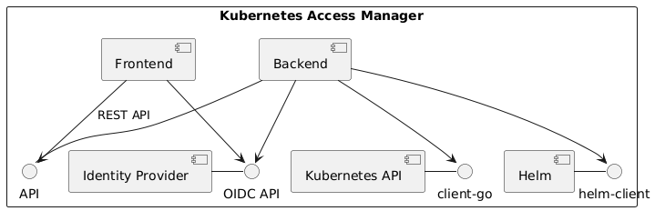
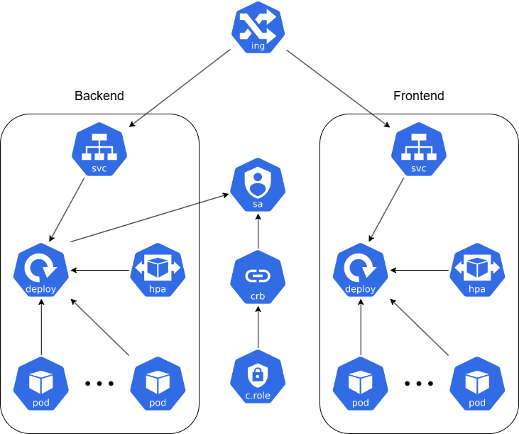
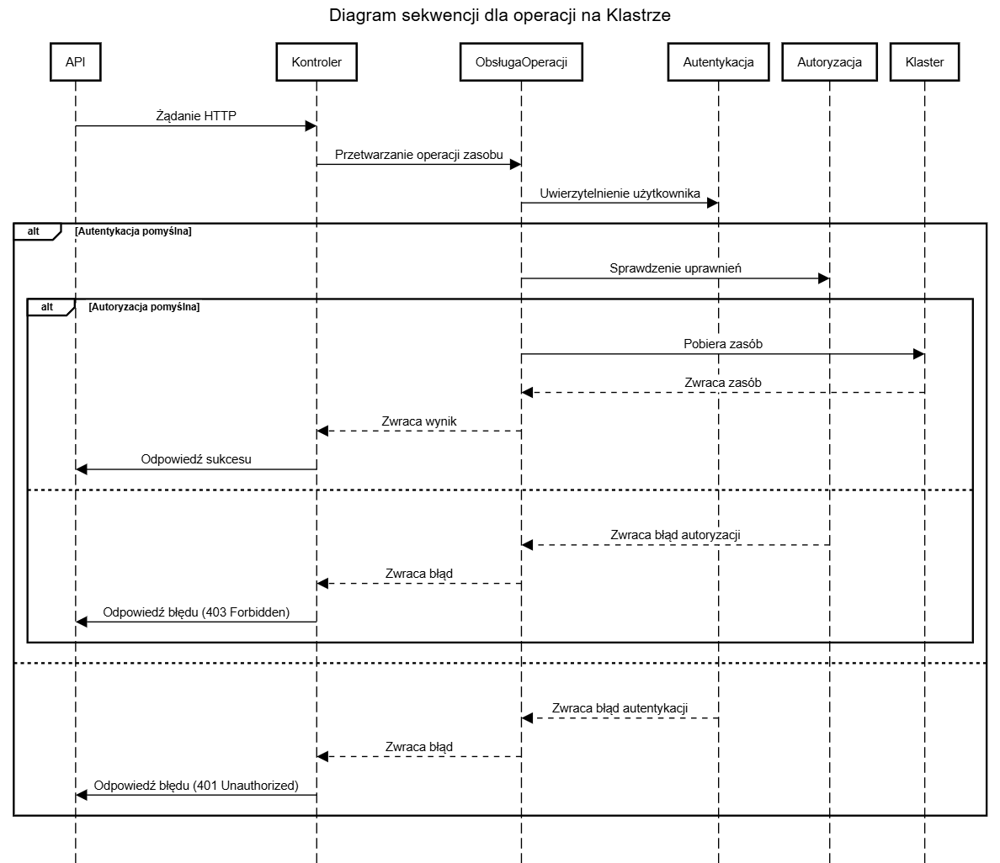
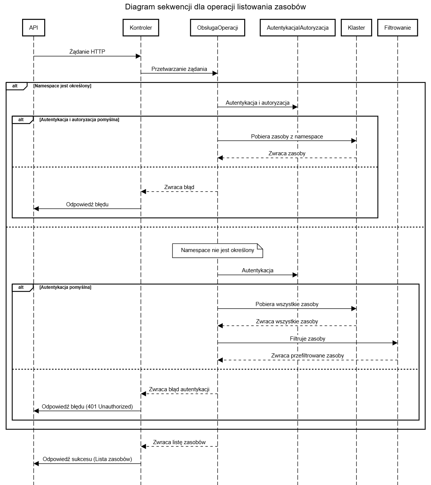

## For English Press [Here](#architecture)

# Architektura

## Ogólna struktura projektu

Kubernetes Access Manager (KAM) składa się z trzech głównych komponentów:
- **Frontend**- aplikacja webowa, która pozwala na zarządzanie zasobami w klastrze Kubernetes. 
Frontend jest odpowiedzialny za wyświetlanie interfejsu użytkownika, a także za komunikację z backendem.
Do uwierzytelniania użytkowników wykorzystuje on tokeny JWT.
- **Backend**- serwer aplikacyjny, który zarządza zasobami w klastrze Kubernetes.
Backend jest odpowiedzialny za autoryzację użytkowników, a także za komunikację z API klastra Kubernetes.
Do uwierzytelniania użytkowników wykorzystuje on tokeny JWT.
- **Identity Provider**- dostawca tożsamości, który pozwala na uwierzytelnianie i autoryzację użytkowników.
Wybrany został protokół OpenID Connect, a jako dostawca tożsamości wykorzystany został Keycloak.
Możliwe jest wykorzystanie dowolnego dostawcy tożsamości, który obsługuje protokół OpenID Connect.

## Część backendowa
REST API napisane w języku Go, które pozwala na zarządzanie zasobami w klastrze Kubernetes.
Może funkcjonować w dwóch trybach:
- **Wewnątrz klastra**- domyślny tryb w obrazach dockerowych, aplikacja pobiera konfigurację bezpośrednio z klastra Kubernetes.
- **Poza klastrem**- domyślny tryb przy zwykłym uruchamianiu, przydatny podczas rozwijania aplikacji lokalnie. Konfiguracja klastra pobierana jest domyślnie z pliku `kubeconfig`.
Możliwe jest również podanie ścieżki do pliku.

Backend komunikuje się z API klastra Kubernetes za pomocą biblioteki `client-go`, natomiast z Klientem Helmowym za pomocą biblioteki `helm`.

### Konfiguracja klastra
Konfiguracja klastra Kubernetes przechowywana jest w singletonie `ClientSingleton`. Sposób pobierania konfiguracji zależy od flagi `--in-cluster`. 
Domyślnie wartość flagi wynosi `false`, co oznacza, że konfiguracja pobierana jest z pliku `kubeconfig`.
W przypadku, gdy flaga przyjmuje wartość `true`, konfiguracja pobierana jest bezpośrednio z klastra Kubernetes.

Lokalizacja pliku `kubeconfig` zależy od dwóch wartości:
- Flagi `--kubeconfig`- ścieżka do pliku `kubeconfig`.
- Zmiennej środowiskowej `KUBECONFIG`- ścieżka do pliku `kubeconfig`.

Jeżeli żadna z tych wartości nie jest podana, domyślnie aplikacja korzysta z pliku `~/.kube/config`.

### Funkcje pomocnicze
- **GetResourceGroupVersion**- na podstawie typu zasobu zwraca informacje potrzebne do generycznego wywołania funkcji z biblioteki `client-go`.
Dodatkowo zwraca informacje o tym, czy zasób jest namespace'owany, czy nie.
- **GetResourceInterface**- dodatkowy poziom abstrakcji umożliwiający wstrzykiwanie zależności (dependency injection) w testach jednostkowych.
Równocześnie upraszcza i ujednolica wywołanie funkcji `client-go`.
- **WatchForChanges**- funkcja umożliwiająca obserwowanie zmian w ConfigMap'ie opisującej role wykorzystywane w autoryzacji.

### Funkcje CreateResource, GetResource, UpdateResource, DeleteResource
Funkcje te wykorzystują bibliotekę `client-go` do komunikacji z API klastra Kubernetes. Jako argumenty przyjmują kolejno:
- GetResource- typ zasobu, namespace, nazwę zasobu.
- CreateResource- typ zasobu, namespace, definicja zasobu.
- UpdateResource- typ zasobu, namespace, nazwę zasobu, definicja zasobu.
- DeleteResource- typ zasobu, namespace, nazwę zasobu.

W przypadku gdy zasób jest namespace'owany, a użytkownik nie poda namespace, zasób zostanie utworzony w namespace'u `default`.

Definicja zasobu reprezentowana jest za pomocą luźnej struktury nieustrukturyzowanych danych zasobu.

Funkcje create, get i update zwracają definicję zasobu lub błąd w przypadku niepowodzenia. Funkcja delete zwraca błąd w przypadku niepowodzenia.

Funkcje te są w stanie obsłużyć wszystkie typy zasobów, jednak ze względu na funkcje listowania zakres został ograniczony do 20 typów wymienionych w części `Funkcja list`.

### Funkcja ListResources
Funkcja ta wykorzystuje bibliotekę `client-go` do komunikacji z API klastra Kubernetes. 
Jako argumenty przyjmuje: typ zasobu i namespace.

W przypadku gdy zasób jest namespace'owany, a użytkownik nie poda namespace, zwracane są zasoby ze wszystkich namespace'ów.

Funkcja dla każdego typu zasobu zwraca określoną listę wartości oraz listę nazw zwracanych pól.
- Dla zasobów typu `ReplicaSet` zwracane są wartości `name`, `namespace`, `desired`, `current`, `ready`, `age`.
- Dla zasobów typu `Pod` zwracane są wartości `name`, `namespace`, `containers`, `restarts`, `controlled_by`, `node`, `qos`, `age`, `status`.
- Dla zasobów typu `Deployment` zwracane są wartości `name`, `namespace`, `pods`, `replicas`, `age`, `conditions`.
- Dla zasobów typu `ConfigMap` zwracane są wartości `name`, `namespace`, `keys`, `age`.
- Dla zasobów typu `Secret` zwracane są wartości `name`, `namespace`, `labels`, `keys`, `type`, `age`.
- Dla zasobów typu `Ingress` zwracane są wartości `name`, `namespace`, `loadbalancers`, `age`.
- Dla zasobów typu `PersistentVolumeClaim` zwracane są wartości `name`, `namespace`, `storage_class`, `size`, `age`, `status`.
- Dla zasobów typu `StatefulSet` zwracane są wartości `name`, `namespace`, `pods`, `replicas`, `age`.
- Dla zasobów typu `DaemonSet` zwracane są wartości `name`, `namespace`, `pods`, `node_selector`, `age`.
- Dla zasobów typu `Job` zwracane są wartości `name`, `namespace`, `completions`, `age`, `conditions`.
- Dla zasobów typu `CronJob` zwracane są wartości `name`, `namespace`, `schedule`, `suspend`, `active`, `last_schedule`, `age`.
- Dla zasobów typu `Service` zwracane są wartości `name`, `namespace`, `type`, `cluster_ip`, `ports`, `external_ip`, `selector`, `age`.
- Dla zasobów typu `ServiceAccount` zwracane są wartości `name`, `namespace`, `age`.
- Dla zasobów typu `Node` zwracane są wartości `name`, `taints`, `roles`, `version`, `age`, `conditions`.
- Dla zasobów typu `Namespace` zwracane są wartości `name`, `labels`, `status`, `age`.
- Dla zasobów typu `CustomResourceDefinition` zwracane są wartości `resource`, `group`, `version`, `scope`, `age`.
- Dla zasobów typu `PersistentVolume` zwracane są wartości `name`, `storage_class`, `capacity`, `claim`, `age`, `status`.
- Dla zasobów typu `StorageClass` zwracane są wartości `name`, `provisioner`, `reclaim_policy`, `default`, `age`.
- Dla zasobów typu `ClusterRole` zwracane są wartości `name`, `age`.
- Dla zasobów typu `ClusterRoleBinding` zwracane są wartości `name`, `bindings`, `age`.

Każda z wartości pól wydobywana jest w sposób unikalny, w wielu przypadkach nawet te same pola mogą być różnie wyliczane w zależności od typu zasobu.

### Konfiguracja Akcji Helm
Konfiguracja ta tworzona jest za pomocą funkcji `getActionConfig` na podstawie konfiguracji klastra Kubernetes oraz namespace'a, w którym ma zostać wykonana akcja.

Ze względu na testowanie kodu, funkcja `getActionConfig` zwraca strukturę `ActionConfig` zawierającą konfigurację `action.Configuration`.
Zdefiniowany został interfejs `ActionConfigInterface`, który umożliwia wstrzykiwanie zależności (dependency injection) w testach jednostkowych.
Składa się na niego pięć funkcji: `getRelease`, `rollbackRelease`, `uninstallRelease`, `getReleaseHistory`, `listReleases`.

### Funkcje pomocnicze
- **PrepareActionConfig**- przygotowuje `ActionConfig` na podstawie konfiguracji konfiguracji klastra zawartej w `ClientSingleton`.

### Funkcje getRelease, rollbackRelease, uninstallRelease, getReleaseHistory
Funkcje te wykorzystują bibliotekę `helm` do komunikacji z Klientem Helmowym. Jako argumenty przyjmują kolejno:
- GetRelease- nazwę releasu.
- RollbackRelease- nazwę releasu, numer wersji.
- UninstallRelease- nazwę releasu.
- GetReleaseHistory- nazwę releasu, maksymalną ilość wersji.

Ze względu na specyfikę języka Go, funkcje te zachowują się jak metody operujące na strukturze `ActionConfig`.
Dzięki interfejsowi `ActionConfigInterface` możliwe jest wstrzykiwanie zależności (dependency injection) w testach jednostkowych.

### Funkcja listReleases
Funkcja ta wykorzystuje bibliotekę `helm` do komunikacji z Klientem Helmowym. Zwraca listę releasów lub błąd w przypadku niepowodzenia.

### Zarządzanie uprawnieniami
Uprawnienia użytkowników przechowywane są w singletonie `RoleMapRepository`.
Pobierane są one z ConfigMapy, której nazwę i namespace określają zmienne środowiskowe `ROLEMAP_NAME` i `ROLEMAP_NAMESPACE`.

RoleMapRepository przechowuje dwa drzewa (grafy skierowane acykliczne):
- **RoleMap**- drzewo reprezentujące mapowanie pomiędzy uprawnieniami a rolami.
- **SubRoleMap**- drzewo reprezentujące mapowanie pomiędzy uprawnieniami a podrolami.

RoleMapRepository obserwuje zmiany w ConfigMapie i aktualizuje drzewa w przypadku zmian.

Role i podrole są strukturami składającymi się z następujących pól:
- **Name**- nazwa roli.
- **Permit**- zestaw operacji, na które rola pozwala.
- **Deny**- zestaw uprawnień, które rola zabrania.
- **SubRoles**- lista podról, po których dziedziczy rola.

Operacja składa się z następujących pól:
- **Resource**- typ zasobu.
- **Namespace**- namespace.
- **Type**- typ operacji (Create, Read, Update, Delete, List).

RoleMapRepository udostępnia funkcje umożliwiające sprawdzanie uprawnień użytkownika.

RoleMapRepository udostępnia również inną reprezentację mapowania ról.
Zamiast drzewa, uprawnienia reprezentowane są przez mapę następującej postaci:
namespace (klucz typu string) -> typ zasobu (klucz typu string) -> operacje (zbiór typu string).

Implementacja ta pozwala na szybsze sprawdzanie uprawnień użytkownika i jest wykorzystywana w funkcjach autoryzacyjnych.
Po dodatkowej obróbce zwracana jest poprzez API.

## Część frontendowa
Aplikacja webowa napisana w języku Typescript i wykorzystująca framework React, która pozwala na zarządzanie zasobami w klastrze Kubernetes.
Komunikuje się z backendem za pomocą REST API.

### Nawigacja
Aplikacja wykorzystuje model jednostronicowej strony internetowej (SPA). Do nawigacji wykorzystywana jest biblioteka `react-router-dom`.

Komponentem zarządzającym nawigacją jest `Menu`, który pozwala na nawigację pomiędzy poszczególnymi podstronami aplikacji.
Na podstawie obecnie wybranej podstrony aktualizuje on stan aplikacji, a także wyświetla odpowiedni nagłówek.

### Stałe
W celu ułatwienia zarządzania stałymi stworzony został plik `consts.ts`, w którym przechowywane są wszystkie stałe konfiguracyjne wykorzystywane w aplikacji.
Wartości tam się znajdujące mogą zostać określone za pomocą plików `.env` lub zmiennych środowiskowych.

Wszystkie stałe posiadają wartości domyślne, które są wykorzystywane w przypadku, gdy wartość nie zostanie podana.
Wartości te przystosowane są do uruchomienia aplikacji lokalnie.

### Uwierzytelnianie
Aplikacja wykorzystuje tokeny JWT do uwierzytelniania użytkowników. Tokeny są przechowywane w pamięci przeglądarki, dokładniej w `localStorage`.

Aby umożliwić łatwy dostęp do danych użytkownika, stworzony został kontekst `AuthProvider`, który przechowuje informacje o zalogowanym użytkowniku.
Zawiera on:
- **user**- obiekt przechowujący informacje o zalogowanym użytkowniku.
- **isLoggedIn**- wartość logiczna określająca, czy użytkownik jest zalogowany.
- **handleLogin**- funkcja, która pozwala na zalogowanie użytkownika.
- **handleLogout**- funkcja, która pozwala na wylogowanie użytkownika.
- **permissions**- obiekt reprezentujący uprawnienia użytkownika.
- **setPermissions**- funkcja, która pozwala na ustawienie uprawnień użytkownika.

W celu logowania aplikacja przekierowuje użytkownika na stronę logowania dostarczoną przez dostawcę tożsamości (przykładowo Keycloak).
Adres tej strony dostępny jest w pliku stałych.

Po zalogowaniu użytkownik otrzymuje token JWT, który jest przechowywany w pamięci przeglądarki.
Dodatkowo uruchomiony zostaje serwis, który na podstawie czasu życia tokena dostępu (access token) odświeża go dzięki tokenowi odświeżania (refresh token).

Przy logowaniu wykonywane jest również zapytanie do API w celu pobrania uprawnień użytkownika.
Uprawnienia te przechowywane są w `localStorage` i aktualizowane przy każdym odświeżeniu tokena dostępu.

### Autoryzacja
Aplikacja wykorzystuje mapę uprawnień postaci namespace -> typ zasobu -> operacje. Struktura ta nazwana została `permissions`.

Struktura ta otrzymywana jest z API i przechowywana w `localStorage`. Dostęp do niej możliwy jest dzięki kontekstowi `AuthProvider`.

W celu ułatwienia i standaryzacji sprawdzania uprawnień stworzone zostały następujące funkcje przyjmujące `permissions`:
- **hasPermission**- przyjmuje namespace, typ zasobu i operację.
- **hasPermissionInAnyNamespace**- przyjmuje typ zasobu i operację.
- **hasAnyPermissionInAnyNamespace**- przyjmuje typ zasobu.
- **hasPermissionInAnyResource**- przyjmuje namespace i operację.
- **allowedNamespaces**- przyjmuje typ zasobu i operację.
- **allowedResources**- przyjmuje namespace i operację.

### Zarządzanie rolami
Zarządzanie rolami odbywa się za pomocą formularza dostępnego w aplikacji. Formularz ten pozwala na:
- **Dodanie roli**- dodanie nowej roli do mapowania.
- **Edycję roli**- edycję istniejącej roli w mapowaniu.
- **Usunięcie roli**- usunięcie istniejącej roli z mapowania.
- **Zapisanie zmian**- zapisanie zmian w mapowaniu.

W celu ułatwienia pobierania ról z ConfigMapy stworzone zostały specjalne funkcje i struktury danych:
- **RoleConfigMap**- strukture reprezentująca ConfigMapę na poziomie definicji zasobu. Mapa roli i mapa podroli reprezentowane są jako łancuchy znaków.
- **RoleMap**- przetworzona struktura, reprezentująca mapy ról i podroli jako obiekty.
- **convertRoleConfigMapToRoleMap**- funkcja, która przetwarza RoleConfigMap na RoleMap.
- **convertRoleMapToRoleConfigMap**- funkcja, która przetwarza RoleMap na RoleConfigMap.
- **getRoles**- funkcja, która wykonuje zapytanie do API w celu pobrania ConfigMapy z mapowaniem ról w postaci RoleConfigMap.
- **updateRoles**- funkcja, która wykonuje zapytanie do API w celu zapisania zmian w mapowaniu ról.

### Serwer Nginx
Aplikacja wykorzystuje serwer Nginx do serwowania plików statycznych. Serwer ten uruchamiany jest w kontenerze Dockerowym.

Serwer Nginx skonfigurowany jest tak, aby umożliwiać przekierowanie żądań HTTP na serwer backendowy wewnątrz klastra Kubernetes.

## Dostawca tożsamości
Aplikacja przygotowana została tak, aby nie była zależna od konkretnego dostawcy tożsamości. 
W celu uwierzytelniania i autoryzacji użytkowników wykorzystany został protokół OpenID Connect.

Opis jak skonfigurować podstawową wersję dostawcy tożsamości (w tym przypadku Keycloak) znajduje się [tutaj](keycloak-install&config.md).

## Struktura ConfigMapy z mapowaniem ról
Aplikacja wykorzystuje ConfigMapę znajdującą się w klastrze Kubernetes do przechowywania mapowania pomiędzy uprawnieniami a rolami uzyskanymi z dostawcy tożsamości.

Struktura ConfigMapy składa się z dwóch kluczy:
- **role-map**- klucz zawierający mapowanie pomiędzy uprawnieniami a rolami.
- **subrole-map**- klucz zawierający mapowanie pomiędzy uprawnieniami a podrolami.

Dokładniejszy opis można znaleźć [tutaj](authorization.md).

## Helm chart
Aplikacja uruchamiana jest w klastrze Kubernetes. W celu łatwej instalacji i zarządzania aplikacją wykorzystany został Helm.

Helm chart aplikacji składa się z czterech głównych komponentów:
- **Backend**- serwer aplikacyjny, który zarządza zasobami w klastrze Kubernetes. Składają się na niego:
  - Pod- w nich uruchamiana jest instancja serwera backendowego.
  - Deployment- definiuje, w jaki sposób mają być tworzone i zarządzane instancje podów.
  - Service- umożliwia komunikację pomiędzy częścią frontendową a backendową wewnątrz klastra Kubernetes.
  - Horizontal Pod Autoscaler- umożliwia automatyczne skalowanie liczby podów w zależności od obciążenia.
- **Frontend**- serwer aplikacji webowej, która pozwala na zarządzanie zasobami w klastrze Kubernetes. Składają się na niego:
  - Pod- w nich uruchamiana jest instancja serwera frontendowego.
  - Deployment- definiuje, w jaki sposób mają być tworzone i zarządzane instancje podów.
  - Service- umożliwia komunikację pomiędzy częścią frontendową a backendową wewnątrz klastra Kubernetes.
  - Horizontal Pod Autoscaler- umożliwia automatyczne skalowanie liczby podów w zależności od obciążenia.
- **Access Control**- zbiór zasobów przyznający uprawnienia wymagane w części backendowej. Składają się na niego:
  - Service Account-umożliwia aplikacji dostęp do API klastra Kubernetes.
  - Cluster Role- definiuje zestaw uprawnień wymaganych do zarządzania zasobami w klastrze Kubernetes.
  - Cluster Role Binding- definiuje powiązanie pomiędzy Service Accountem a Cluster Role.
- **Ingress**- definiuje reguły zarządzania ruchem przychodzącym do klastra Kubernetes.

Część **Access Control** jest wymagana tylko w przypadku, gdy na klastrze włączony jest mechanizm RBAC.

Pełna lista parametrów oraz ich opis znajduje się [tutaj](CONFIGURATION.md).

## Diagram przepływu uwierzytelniania i autoryzacji
Przepływ autoryzacji w części backendowej aplikacji podzielić należy na dwie kategorie: dla funkcji CRUD oraz dla funkcji List.

### Funkcje CRUD

Żądanie HTTP z API przekierowywane jest do odpowiedniego kontrolera. Następuje przetworzenie żądania i jego obsługa.
Na podstawie tokena JWT, który znajduje się w nagłówku żądania, serwer uwierzytelnia użytkownika.
Jeżeli użytkownik nie jest zalogowany, serwer zwraca błąd 401.

Po uwierzytelnieniu serwer pobiera role użytkownika zawarte w tokenie JWT. Następnie na podstawie tych ról oraz mapowania ról z ConfigMapy sprawdzane są uprawnienia użytkownika.
Jeżeli użytkownik nie ma uprawnień do wykonania danej operacji, serwer zwraca błąd 403.

Jeżeli użytkownik ma uprawnienia, serwer wykonuje żądaną operację. W przypadku powodzenia zwraca kod 200, w przeciwnym wypadku zwraca odpowiedź json z błędem.

W przypadkue aplikacji helmowych, przebieg jest podobny, z tą różnicą, że zamiast odwoływać się do Kubernetes API, odwołuje się do Klienta Helmowego.

### Funkcja List

Przepływ autoryzacji dla funkcji List jest podobny do przepływu dla funkcji CRUD kiedy określony jest namespace.

W przypadku, gdy namespace nie jest określony, najpierw następuje uwierzytelnienie użytkownika. Następnie pobierane są zasoby z klastra.
Na podstawie ról z tokena JWT oraz mapowania ról z ConfigMapy sprawdzane są uprawnienia użytkownika do każdego namespace'u.

Jeżeli użytkownik ma uprawnienia do listowania zasobów w danym namespace'sie, dodawane są one do listy zasobów zwracanej przez serwer.
W przeciwnym wypadku zasoby nie są dodawane do listy.

Jeżeli uwierzytelnienie użytkownika nie powiedzie się, serwer zwraca błąd 401.

# Architecture

## General project structure

Kubernetes Access Manager (KAM) consists of three main components:
- **Frontend**- a web application that allows managing resources in a Kubernetes cluster.
The frontend is responsible for displaying the user interface and communicating with the backend.
It uses JWT tokens to authenticate users.
- **Backend**- an application server that manages resources in a Kubernetes cluster.
The backend is responsible for authorizing users and communicating with the Kubernetes API.
It uses JWT tokens to authenticate users.
- **Identity Provider**- an identity provider that allows authenticating and authorizing users.
The OpenID Connect protocol was chosen, and Keycloak was used as the identity provider.
It is possible to use any identity provider that supports the OpenID Connect protocol.

## Backend
A REST API written in Go that allows managing resources in a Kubernetes cluster.
It can operate in two modes:
- **Inside the cluster** - the default mode in Docker images, the application retrieves configuration directly from the Kubernetes cluster.
- **Outside the cluster** - the default mode when running locally, useful for developing the application. The cluster configuration is retrieved from the `kubeconfig` file.
It is also possible to provide a path to the file.

The backend communicates with the Kubernetes API using the `client-go` library and with the Helm Client using the `helm` library.

### Cluster configuration
The Kubernetes cluster configuration is stored in the `ClientSingleton` singleton. The method of retrieving the configuration depends on the `--in-cluster` flag.
By default, the flag value is `false`, which means that the configuration is retrieved from the `kubeconfig` file.
If the flag takes the value `true`, the configuration is retrieved directly from the Kubernetes cluster.

The location of the `kubeconfig` file depends on two values:
- The `--kubeconfig` flag - the path to the `kubeconfig` file.
- The `KUBECONFIG` environment variable - the path to the `kubeconfig` file.

If none of these values are provided, the application defaults to using the `~/.kube/config` file.

### Helper functions
- **GetResourceGroupVersion**- based on the resource type, it returns the information needed to call the `client-go` library functions generically.
It also returns information about whether the resource is namespaced or not.
- **GetResourceInterface**- an additional level of abstraction that allows dependency injection in unit tests.
At the same time, it simplifies and standardizes the of `client-go` functions.
- **WatchForChanges**- a function that allows observing changes in the ConfigMap describing the roles used in authorization.

### CreateResource, GetResource, UpdateResource, DeleteResource functions
These functions use the `client-go` library to communicate with the Kubernetes API. They take the following arguments:
- GetResource- resource type, namespace, resource name.
- CreateResource- resource type, namespace, resource definition.
- UpdateResource- resource type, namespace, resource name, resource definition.
- DeleteResource- resource type, namespace, resource name.

If the resource is namespaced and the user does not provide a namespace, the resource will be created in the `default` namespace.

Resource definition is represented by a loose structure of unstructured resource data.

The create, get, and update functions return the resource definition or an error in case of failure. The delete function returns an error in case of failure.

These functions are able to handle all types of resources, but due to the listing functions, the scope has been limited to 20 types listed in the `List function` section.

### ListResources function
This function uses the `client-go` library to communicate with the Kubernetes API. It takes the following arguments: resource type and namespace.

If the resource is namespaced and the user does not provide a namespace, the resources from all namespaces are returned.

For each resource type, the function returns a specific list of values and a list of names of the returned fields.
- For resources of type `ReplicaSet`, the values `name`, `namespace`, `desired`, `current`, `ready`, `age` are returned.
- For resources of type `Pod`, the values `name`, `namespace`, `containers`, `restarts`, `controlled_by`, `node`, `qos`, `age`, `status` are returned.
- For resources of type `Deployment`, the values `name`, `namespace`, `pods`, `replicas`, `age`, `conditions` are returned.
- For resources of type `ConfigMap`, the values `name`, `namespace`, `keys`, `age` are returned.
- For resources of type `Secret`, the values `name`, `namespace`, `labels`, `keys`, `type`, `age` are returned.
- For resources of type `Ingress`, the values `name`, `namespace`, `loadbalancers`, `age` are returned.
- For resources of type `PersistentVolumeClaim`, the values `name`, `namespace`, `storage_class`, `size`, `age`, `status` are returned.
- For resources of type `StatefulSet`, the values `name`, `namespace`, `pods`, `replicas`, `age` are returned.
- For resources of type `DaemonSet`, the values `name`, `namespace`, `pods`, `node_selector`, `age` are returned.
- For resources of type `Job`, the values `name`, `namespace`, `completions`, `age`, `conditions` are returned.
- For resources of type `CronJob`, the values `name`, `namespace`, `schedule`, `suspend`, `active`, `last_schedule`, `age` are returned.
- For resources of type `Service`, the values `name`, `namespace`, `type`, `cluster_ip`, `ports`, `external_ip`, `selector`, `age` are returned.
- For resources of type `ServiceAccount`, the values `name`, `namespace`, `age` are returned.
- For resources of type `Node`, the values `name`, `taints`, `roles`, `version`, `age`, `conditions` are returned.
- For resources of type `Namespace`, the values `name`, `labels`, `status`, `age` are returned.
- For resources of type `CustomResourceDefinition`, the values `resource`, `group`, `version`, `scope`, `age` are returned.
- For resources of type `PersistentVolume`, the values `name`, `storage_class`, `capacity`, `claim`, `age`, `status` are returned.
- For resources of type `StorageClass`, the values `name`, `provisioner`, `reclaim_policy`, `default`, `age` are returned.
- For resources of type `ClusterRole`, the values `name`, `age` are returned.
- For resources of type `ClusterRoleBinding`, the values `name`, `bindings`, `age` are returned.

Each of the field values is extracted uniquely, in many cases even the same fields can be calculated differently depending on the resource type.

### Helm Action Configuration
This configuration is created using the `getActionConfig` function based on the Kubernetes cluster configuration and the namespace in which the action is to be performed.

Due to testing the code, the `getActionConfig` function returns the `ActionConfig` structure containing the `action.Configuration` configuration.
An `ActionConfigInterface` interface has been defined, which allows dependency injection in unit tests.
It consists of five functions: `getRelease`, `rollbackRelease`, `uninstallRelease`, `getReleaseHistory`, `listReleases`.

### Helper functions
- **PrepareActionConfig**- prepares the `ActionConfig` based on the cluster configuration contained in the `ClientSingleton`.

### getRelease, rollbackRelease, uninstallRelease, getReleaseHistory functions
These functions use the `helm` library to communicate with the Helm Client. They take the following arguments:
- GetRelease- release name.
- RollbackRelease- release name, revision number.
- UninstallRelease- release name.
- GetReleaseHistory- release name, maximum number of versions.

Due to the specifics of the Go language, these functions behave like methods operating on an `ActionConfig` structure.
Thanks to the `ActionConfigInterface` interface, dependency injection is possible in unit tests.

### listReleases function
This function uses the `helm` library to communicate with the Helm Client. The function returns a list of releases or an error in case of failure.

### Managing permissions
User permissions are stored in the `RoleMapRepository` singleton. They are retrieved from the ConfigMap, the name and namespace of which determine the `ROLEMAP_NAME` and `ROLEMAP_NAMESPACE` environment variables.

The `RoleMapRepository` stores two trees (directed acyclic graphs):
- **RoleMap**- a tree representing the mapping between permissions and roles.
- **SubRoleMap**- a tree representing the mapping between permissions and subroles.

The `RoleMapRepository` observes changes in the ConfigMap and updates the trees in case of changes.

Roles and subroles are structures consisting of the following fields:
- **Name**- role name.
- **Permit**- a list of operations that the role allows.
- **Deny**- a list of permissions that the role denies.
- **SubRoles**- a list of subroles that the role inherits from.

An operation consists of the following fields:
- **Resource**- resource type.
- **Namespace**- namespace.
- **Type**- operation type (Create, Read, Update, Delete, List).

The `RoleMapRepository` provides functions that allow checking user permissions.

The `RoleMapRepository` also provides another representation of role mapping.
Instead of a tree, permissions are represented by a map of the following form:
namespace (string type key) -> resource type (string type key) -> operations (string type set).

This implementation allows for faster checking of user permissions and is used in authorization functions.
After additional processing, it is returned through the API.

## Frontend
A web application written in Typescript and using the React framework that allows managing resources in a Kubernetes cluster.
It communicates with the backend via the REST API.

### Navigation
The application uses the single-page model of a website (SPA). The `react-router-dom` library is used for navigation.

The `Menu` component is responsible for managing navigation between the individual subpages of the application.
Based on the currently selected subpage, it updates the application state and displays the appropriate header.

### Constants
To simplify the management of constants, a `consts.ts` file was created, which stores all the configuration constants used in the application.
The values found there can be specified using `.env` files or environment variables.

All constants have default values that are used if the value is not provided.
These values are designed to run the application locally.

### Authentication
The application uses JWT tokens to authenticate users. Tokens are stored in the browser's memory, more precisely in `localStorage`.

To provide easy access to user data, the `AuthProvider` context was created, which stores information about the logged-in user.
It contains
- **user**- an object storing information about the logged-in user.
- **isLoggedIn**- a logical value indicating whether the user is logged in.
- **handleLogin**- a function that allows logging in the user.
- **handleLogout**- a function that allows logging out the user.
- **permissions**- an object representing user permissions.
- **setPermissions**- a function that allows setting user permissions.

To log in, the application redirects the user to the login page provided by the identity provider (for example Keycloak).
The address of this page is available in the constants file.

After logging in, the user receives a JWT token, which is stored in the browser's memory.
Additionally, a service is started that refreshes the access token based on its lifetime using the refresh token.

When logging in, a request is also made to the API to retrieve user permissions.
These permissions are stored in `localStorage` and updated with each access token refresh.

### Authorization
The application uses a permissions map of the form namespace -> resource type -> operations. This structure is called `permissions`.

The structure is received from the API and stored in `localStorage`. Access to it is possible through the `AuthProvider` context.

To simplify and standardize checking user permissions, the following functions were created that take `permissions` as an argument:
- **hasPermission**- takes namespace, resource type, and operation.
- **hasPermissionInAnyNamespace**- takes resource type and operation.
- **hasAnyPermissionInAnyNamespace**- takes resource type.
- **hasPermissionInAnyResource**- takes namespace and operation.
- **allowedNamespaces**- takes resource type and operation.
- **allowedResources**- takes namespace and operation.

### Managing roles
Role management is done through a form available in the application. This form allows:
- **Adding a role**- adding a new role to the mapping.
- **Editing a role**- editing an existing role in the mapping.
- **Deleting a role**- deleting an existing role from the mapping.
- **Saving changes**- saving changes in the mapping.

To facilitate retrieving roles from the ConfigMap, special functions and data structures were created:
- **RoleConfigMap**- a structure representing a ConfigMap at the resource definition level. The role map and subrole map are represented as strings.
- **RoleMap**- a processed structure representing role and subrole maps as objects.
- **convertRoleConfigMapToRoleMap**- a function that converts RoleConfigMap to RoleMap.
- **convertRoleMapToRoleConfigMap**- a function that converts RoleMap to RoleConfigMap.
- **getRoles**- a function that makes a request to the API to retrieve the ConfigMap with role mapping in the form of RoleConfigMap.
- **updateRoles**- a function that makes a request to the API to save changes in role mapping.

### Nginx Server
The application uses the Nginx server to serve static files. The server is run in a Docker container.

The Nginx server is configured to allow redirection of HTTP requests to the backend server inside the Kubernetes cluster.

## Identity Provider
The application is designed to be independent of a specific identity provider.
The OpenID Connect protocol was used for user authentication and authorization.

Instructions on how to configure a basic version of the identity provider (in this case Keycloak) can be found [here](keycloak-install&config.md).

## ConfigMap structure with role mapping
The application uses a ConfigMap located in the Kubernetes cluster to store the mapping between permissions and roles obtained from the identity provider.

The structure of the ConfigMap consists of two keys:
- **role-map**- a key containing the mapping between permissions and roles.
- **subrole-map**- a key containing the mapping between permissions and subroles.

A more detailed description can be found [here](authorization.md).

## Helm chart
The application is run in a Kubernetes cluster. To facilitate installation and management of the application, Helm was used.

The Helm chart of the application consists of four main components:
- **Backend**- an application server that manages resources in a Kubernetes cluster. It consists of:
  - Pod- where the backend server instance is run.
  - Deployment- defines how pod instances are to be created and managed.
  - Service- enables communication between the frontend and backend parts within the Kubernetes cluster.
  - Horizontal Pod Autoscaler- allows automatic scaling of the number of pods depending on the load.
- **Frontend**- a web application server that allows managing resources in a Kubernetes cluster. It consists of:
  - Pod- where the frontend server instance is run.
  - Deployment- defines how pod instances are to be created and managed.
  - Service- enables communication between the frontend and backend parts within the Kubernetes cluster.
  - Horizontal Pod Autoscaler- allows automatic scaling of the number of pods depending on the load.
- **Access Control**- a set of resources granting permissions required in the backend part. It consists of:
  - Service Account- enables the application to access the Kubernetes API.
  - Cluster Role- defines the set of permissions required to manage resources in the Kubernetes cluster.
  - Cluster Role Binding- defines the binding between the Service Account and the Cluster Role.
- **Ingress**- defines rules for managing incoming traffic to the Kubernetes cluster.

The **Access Control** part is required only if the RBAC mechanism is enabled on the cluster.

A full list of parameters and their description can be found [here](CONFIGURATION.md).

## Authentication and Authorization Flow Diagram
The authorization flow in the backend part of the application can be divided into two categories: for CRUD functions and for List functions.

### CRUD functions

The HTTP request from the API is redirected to the appropriate controller. The request is processed and handled.
Based on the JWT token, which is in the request header, the server authenticates the user.
If the user is not logged in, the server returns a 401 error.

After authentication, the server retrieves the user roles contained in the JWT token. Then, based on these roles and the role mapping from the ConfigMap, the user's permissions are checked.
If the user does not have permissions to perform the operation, the server returns a 403 error.

If the user has permissions, the server performs the requested operation. In case of success, it returns a 200 code, otherwise it returns a json response with an error.

In the case of Helm applications, the process is similar, with the difference that instead of referring to the Kubernetes API, it refers to the Helm Client.

### List function

The authorization flow for the List function is similar to the flow for the CRUD function when a specific namespace is specified.

If the namespace is not specified, the user is first authenticated. Then the resources are retrieved from the cluster.
Based on the roles from the JWT token and the role mapping from the ConfigMap, the user's permissions for each namespace are checked.

If the user has permissions to list resources in a given namespace, they are added to the list of resources returned by the server.
Otherwise, the resources are not added to the list.

If user authentication fails, the server returns a 401 error.