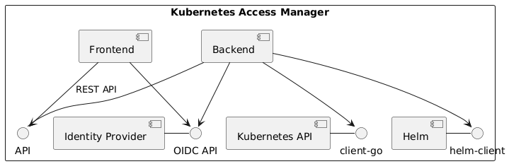
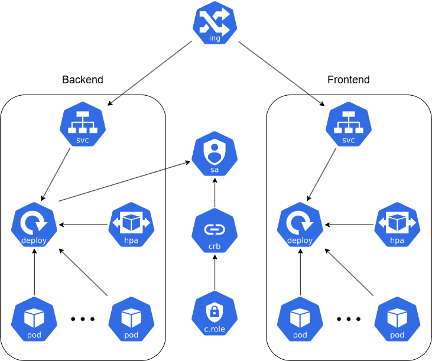
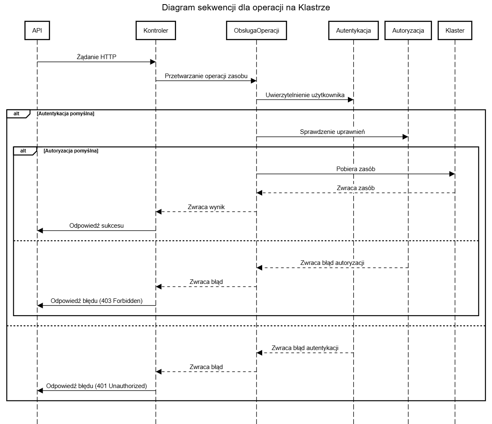

## For English Press [Here]()

# Architektura

## Ogólna struktura projektu

Kubernetes Access Manager (KAM) składa się z trzech głównych komponentów:
- **Frontend**- aplikacja webowa, która pozwala na zarządzanie zasobami w klastrze Kubernetes. 
Frontend jest odpowiedzialny za wyświetlanie interfejsu użytkownika, a także za komunikację z backendem.
Do uwierzytelniania użytkowników wykorzystuje on tokeny JWT.
- **Backend**- serwer aplikacyjny, który zarządza zasobami w klastrze Kubernetes.
Backend jest odpowiedzialny za autoryzację użytkowników, a także za komunikację z API klastra Kubernetes.
Do uwierzytelniania użytkowników wykorzystuje on tokeny JWT.
- **Identity Provider**- dostawca tożsamości, który pozwala na uwierzytelnianie i autoryzację użytkowników.
Wybrany został protokół OpenID Connect, a jako dostawca tożsamości wykorzystany został Keycloak.

Kam komunikuje się z API klastra Kubernetes za pomocą biblioteki `client-go`, natomiast z Klientem Helmowym za pomocą biblioteki `helm`.

## Helm chart
Aplikacja uruchamiana jest w klastrze Kubernetes. W celu łatwej instalacji i zarządzania aplikacją wykorzystany został Helm.

Helm chart aplikacji składa się z czterech głównych komponentów:
- **Backend**- serwer aplikacyjny, który zarządza zasobami w klastrze Kubernetes. Składają się na niego:
    - Pod- w nich uruchamiana jest instancja serwera backendowego.
    - Deployment- definiuje, w jaki sposób mają być tworzone i zarządzane instancje podów.
    - Service- umożliwia komunikację pomiędzy częścią frontendową a backendową wewnątrz klastra Kubernetes.
    - Horizontal Pod Autoscaler- umożliwia automatyczne skalowanie liczby podów w zależności od obciążenia.
- **Frontend**- serwer aplikacji webowej, która pozwala na zarządzanie zasobami w klastrze Kubernetes. Składają się na niego:
    - Pod- w nich uruchamiana jest instancja serwera frontendowego.
    - Deployment- definiuje, w jaki sposób mają być tworzone i zarządzane instancje podów.
    - Service- umożliwia komunikację pomiędzy częścią frontendową a backendową wewnątrz klastra Kubernetes.
    - Horizontal Pod Autoscaler- umożliwia automatyczne skalowanie liczby podów w zależności od obciążenia.
- **Access Control**- zbiór zasobów przyznający uprawnienia wymagane w części backendowej. Składają się na niego:
    - Service Account-umożliwia aplikacji dostęp do API klastra Kubernetes.
    - Cluster Role- definiuje zestaw uprawnień wymaganych do zarządzania zasobami w klastrze Kubernetes.
    - Cluster Role Binding- definiuje powiązanie pomiędzy Service Accountem a Cluster Role.
- **Ingress**- definiuje reguły zarządzania ruchem przychodzącym do klastra Kubernetes.

Część **Access Control** jest wymagana tylko w przypadku, gdy na klastrze włączony jest mechanizm RBAC.

## Część backendowa
REST API napisane w języku Go, które pozwala na zarządzanie zasobami w klastrze Kubernetes.
Może funkcjonować w dwóch trybach:
- **Wewnątrz klastra**- domyślny tryb w obrazach dockerowych, aplikacja pobiera konfigurację bezpośrednio z klastra Kubernetes.
- **Zewnętrzny**- domyślny tryb przy zwykłym uruchamianiu, przydatny podczas rozwijania aplikacji lokalnie. Konfiguracja klastra pobierana jest domyślnie z pliku `kubeconfig`.
Możliwe jest również podanie ścieżki do pliku.

Backend komunikuje się z API klastra Kubernetes za pomocą biblioteki `client-go`, natomiast z Klientem Helmowym za pomocą biblioteki `helm`.

### Konfiguracja klastra
Konfiguracja klastra Kubernetes przechowywana jest w singletonie `ClientSingleton`. Sposób pobierania konfiguracji zależy od flagi `--in-cluster`. 
Domyślnie wartość flagi wynosi `false`, co oznacza, że konfiguracja pobierana jest z pliku `kubeconfig`.
W przypadku, gdy flaga przyjmuje wartość `true`, konfiguracja pobierana jest bezpośrednio z klastra Kubernetes.

Lokalizacja pliku `kubeconfig` zależy od dwóch wartości:
- Flagi `--kubeconfig`- ścieżka do pliku `kubeconfig`.
- Zmiennej środowiskowej `KUBECONFIG`- ścieżka do pliku `kubeconfig`.

Jeżeli żadna z tych wartości nie jest podana, domyślnie aplikacja korzysta z pliku `~/.kube/config`.

### Funkcje pomocnicze
- **GetResourceGroupVersion**- na podstawie typu zasobu zwraca informacje potrzebne do generycznego wywołania funkcji `client-go`.
  Dodatkowo zwraca informacje o tym, czy zasób jest namespace'owany, czy nie.
- **GetResourceInterface**- dodatkowy poziom abstrakcji umożliwiający wstrzykiwanie zależności (dependency injection) w testach jednostkowych.
  Równocześnie upraszcza i ujednolica wywołanie funkcji `client-go`.
- **WatchForChanges**- funkcja umożliwiająca obserwowanie zmian w zasobie opisującym role wykorzystywane w autoryzacji.
- **transposeResourceListColumns**- funkcja pomocnicza, która zamienia listę zasobów i ich pól (postaci mapy nazwa_zasobu -> jej_pola) na listę pól i do jakich typów zasobów należą (postaci mapy nazwa_pola -> lista_typów).

### Funkcje CreateResource, GetResource, UpdateResource, DeleteResource
Funkcje te wykorzystują bibliotekę `client-go` do komunikacji z API klastra Kubernetes. Jako argumenty przyjmują kolejno:
- GetResource- typ zasobu (resourceType), namespace, nazwę zasobu (resourceName).
- CreateResource- typ zasobu (resourceType), namespace, zasób (ResourceDetails).
- UpdateResource- typ zasobu (resourceType), namespace, nazwę zasobu (resourceName), zasób (ResourceDetails).
- DeleteResource- typ zasobu (resourceType), namespace, nazwę zasobu (resourceName).

W przypadku gdy zasób jest namespace'owany, a użytkownik nie poda namespace, zasób zostanie utworzony w namespace'u `default`.

ResourceDetails to luźna struktura, która reprezentuje nieustrukturyzowane dane zasobu.

Funkcje create, get i update zwracają zasób w postaci struktury `ResourceDetails` lub błąd w przypadku niepowodzenia. Funkcja delete zwraca błąd w przypadku niepowodzenia.

Funkcje te są w stanie obsłużyć wszystkie typy zasobów, jednak ze względu na funkcje listowania zakres został ograniczony do 20 typów wymienionych w części `Funkcja list`.

### Funkcja ListResources
Funkcja ta wykorzystuje bibliotekę `client-go` do komunikacji z API klastra Kubernetes. 
Jako argumenty przyjmuje: typ zasobu (resourceType), namespace.

W przypadku gdy zasób jest namespace'owany, a użytkownik nie poda namespace, zwracane są zasoby ze wszystkich namespace'ów.

Funkcja dla każdego typu zasobu zwraca określoną listę wartości oraz listę nazw zwracanych pól.
- Dla zasobów typu `ReplicaSet` zwracane są wartości `name`, `namespace`, `desired`, `current`, `ready`, `age`.
- Dla zasobów typu `Pod` zwracane są wartości `name`, `namespace`, `containers`, `restarts`, `controlled_by`, `node`, `qos`, `age`, `status`.
- Dla zasobów typu `Deployment` zwracane są wartości `name`, `namespace`, `pods`, `replicas`, `age`, `conditions`.
- Dla zasobów typu `ConfigMap` zwracane są wartości `name`, `namespace`, `keys`, `age`.
- Dla zasobów typu `Secret` zwracane są wartości `name`, `namespace`, `labels`, `keys`, `type`, `age`.
- Dla zasobów typu `Ingress` zwracane są wartości `name`, `namespace`, `loadbalancers`, `age`.
- Dla zasobów typu `PersistentVolumeClaim` zwracane są wartości `name`, `namespace`, `storage_class`, `size`, `age`, `status`.
- Dla zasobów typu `StatefulSet` zwracane są wartości `name`, `namespace`, `pods`, `replicas`, `age`.
- Dla zasobów typu `DaemonSet` zwracane są wartości `name`, `namespace`, `pods`, `node_selector`, `age`.
- Dla zasobów typu `Job` zwracane są wartości `name`, `namespace`, `completions`, `age`, `conditions`.
- Dla zasobów typu `CronJob` zwracane są wartości `name`, `namespace`, `schedule`, `suspend`, `active`, `last_schedule`, `age`.
- Dla zasobów typu `Service` zwracane są wartości `name`, `namespace`, `type`, `cluster_ip`, `ports`, `external_ip`, `selector`, `age`.
- Dla zasobów typu `ServiceAccount` zwracane są wartości `name`, `namespace`, `age`.
- Dla zasobów typu `Node` zwracane są wartości `name`, `taints`, `roles`, `version`, `age`, `conditions`.
- Dla zasobów typu `Namespace` zwracane są wartości `name`, `labels`, `status`, `age`.
- Dla zasobów typu `CustomResourceDefinition` zwracane są wartości `resource`, `group`, `version`, `scope`, `age`.
- Dla zasobów typu `PersistentVolume` zwracane są wartości `name`, `storage_class`, `capacity`, `claim`, `age`, `status`.
- Dla zasobów typu `StorageClass` zwracane są wartości `name`, `provisioner`, `reclaim_policy`, `default`, `age`.
- Dla zasobów typu `ClusterRole` zwracane są wartości `name`, `age`.
- Dla zasobów typu `ClusterRoleBinding` zwracane są wartości `name`, `bindings`, `age`.

Każda z wartości pól wydobywana jest w sposób unikalny, w wielu przypadkach nawet te same pola mogą być różnie wyliczane w zależności od typu zasobu.

### Konfiguracja Akcji Helm
Konfiguracja ta tworzona jest za pomocą funkcji `getActionConfig` na podstawie konfiguracji klastra Kubernetes oraz namespace'a, w którym ma zostać wykonana akcja.

Ze względu na testowanie kodu, funkcja `getActionConfig` zwraca strukturę `ActionConfig` zawierającą konfigurację `action.Configuration`.
Zdefiniowany został interfejs `ActionConfigInterface`, który umożliwia wstrzykiwanie zależności (dependency injection) w testach jednostkowych.
Składa się na niego pięć funkcji: `getRelease`, `rollbackRelease`, `uninstallRelease`, `getReleaseHistory`, `listReleases`.

### Funkcje pomocnicze
- **PrepareActionConfig**- przygotowuje `ActionConfig` na podstawie konfiguracji konfiguracji klastra zawartej w `ClientSingleton`.

### Funkcje getRelease, rollbackRelease, uninstallRelease, getReleaseHistory
Funkcje te wykorzystują bibliotekę `helm` do komunikacji z Klientem Helmowym. Jako argumenty przyjmują kolejno:
- GetRelease- nazwę releasu (releaseName).
- RollbackRelease- nazwę releasu (releaseName), numer wersji (revision).
- UninstallRelease- nazwę releasu (releaseName).
- GetReleaseHistory- nazwę releasu (releaseName), ilość wersji (max).

Ze względu na specyfikę języka Go, funkcje te zachowują się jak metody operujące na obiekcie `ActionConfig`.
Dzięki interfejsowi `ActionConfigInterface` możliwe jest wstrzykiwanie zależności (dependency injection) w testach jednostkowych.

### Funkcja listReleases
Funkcja ta wykorzystuje bibliotekę `helm` do komunikacji z Klientem Helmowym. Jako argumenty przyjmuje: allNamespaces (określa, czy zwrócić releasy z wszystkich namespace'ów).

Funkcja ta zwraca listę releasów (Release) lub błąd w przypadku niepowodzenia.

### Zarządzanie uprawnieniami
Tutaj nie czuję się na siłach by to opisać sensownie

## Część frontendowa
Aplikacja webowa napisana w języku Typescript i wykorzystująca framework React, która pozwala na zarządzanie zasobami w klastrze Kubernetes.
Komunikuje się z backendem za pomocą REST API.

### Nawigacja
Aplikacja wykorzystuje model jednostronicowej strony internetowej (SPA). Do nawigacji wykorzystywana jest biblioteka `react-router-dom`.

Komponentem zarządzającym nawigacją jest `Menu`, który pozwala na nawigację pomiędzy poszczególnymi podstronami aplikacji.
Na podstawie obecnie wybranej podstrony aktualizuje on stan aplikacji, a także wyświetla odpowiedni nagłówek.

### Stałe
W celu ułatwienia zarządzania stałymi stworzony został plik `consts.ts`, w którym przechowywane są wszystkie stałe wykorzystywane w aplikacji.
Wartości tam się znajdujące mogą zostać określone za pomocą plików `.env` lub zmiennych środowiskowych.

Do znajdujących się tam wartości należą:
- **API_PREFIX**- prefiks adresu URL, pod którym dostępne jest REST API.
- **K8S_API_URL**- adres URL, pod którym dostępna jest sekcja API klastra Kubernetes.
- **HELM_API_URL**- adres URL, pod którym dostępne jest sekcja API Klienta Helmowego.
- **AUTH_URL**- adres URL, pod którym dostępna jest sekcja autoryzacji.
- **KEYCLOAK_URL**- adres URL, pod którym dostępny jest dostawca tożsamości (Keycloak).
- **KEYCLOAK_CLIENT**- nazwa klienta w dostawcy tożsamości (Keycloak).
- **KEYCLOAK_REALM**- nazwa rzeczywistości w dostawcy tożsamości (Keycloak).
- **KEYCLOAK_LOGIN_URL**- adres URL, pod którym dostępna jest strona logowania dostawcy tożsamości (Keycloak).
W przypadku, gdy wartość ta nie zostanie podana, wyliczana jest na podstawie wartości `KEYCLOAK_URL`, `KEYCLOAK_REALM` oraz `KEYCLOAK_CLIENT`.
- **KEYCLOAK_LOGOUT_URL**- adres URL, pod którym dostępna jest strona wylogowania dostawcy tożsamości (Keycloak).
W przypadku, gdy wartość ta nie zostanie podana, wyliczana jest na podstawie wartości `KEYCLOAK_URL`, `KEYCLOAK_REALM`.
- **KEYCLOAK_TOKEN_URL**- adres URL, pod którym dostępna jest strona pobierania tokenów dostawcy tożsamości (Keycloak).
W przypadku, gdy wartość ta nie zostanie podana, wyliczana jest na podstawie wartości `KEYCLOAK_URL`, `KEYCLOAK_REALM`.
- **ROLEMAP_NAME**- nazwa ConfigMapy, w której przechowywane są mapowania pomiędzy uprawnieniami a rolami uzyskanymi z dostawcy tożsamości.
- **ROLEMAP_NAMESPACE**- namespace, w którym przechowywana jest ConfigMapa `ROLEMAP_NAME`.

Wszystkie stałe posiadają wartości domyślne, które są wykorzystywane w przypadku, gdy wartość nie zostanie podana.

### Uwierzytelnianie
Aplikacja wykorzystuje tokeny JWT do uwierzytelniania użytkowników. Tokeny są przechowywane w pamięci przeglądarki, dokładniej w `localStorage`.

Aby umożliwić łatwy dostęp do danych użytkownika, stworzony został kontekst `AuthProvider`, który przechowuje informacje o zalogowanym użytkowniku.
Zawiera on:
- **user**- obiekt przechowujący informacje o zalogowanym użytkowniku.
- **isLoggedIn**- wartość logiczna określająca, czy użytkownik jest zalogowany.
- **handleLogin**- funkcja, która pozwala na zalogowanie użytkownika.
- **handleLogout**- funkcja, która pozwala na wylogowanie użytkownika.
- **permissions**- obiekt reprezentujący uprawnienia użytkownika.
- **setPermissions**- funkcja, która pozwala na ustawienie uprawnień użytkownika.

W celu logowania aplikacja przekierowuje użytkownika na stronę logowania dostarczoną przez dostawcę tożsamości (Keycloak).
Adres tej strony dostępny jest w pliku stałych.

Po zalogowaniu użytkownik otrzymuje token JWT, który jest przechowywany w pamięci przeglądarki.
Dodatkowo uruchomiony zostaje serwis, który na podstawie czasu życia tokena dostępu (access token) odświeża go dzięki tokenowi odświeżania (refresh token).

Przy logowaniu wykonywane jest również zapytanie do API w celu pobrania uprawnień użytkownika.
Uprawnienia te przechowywane są w `localStorage` i aktualizowane przy każdym odświeżeniu tokena dostępu.

### Autoryzacja
Aplikacja wykorzystuje mapę uprawnień postaci namespace -> typ zasobu -> operacje. Struktura ta nazwana została `permissions`.

Struktura ta otrzymywana jest z API i przechowywana w `localStorage`. Dostęp do niej możliwy jest dzięki kontekstowi `AuthProvider`.

W celu ułatwienia i standaryzacji sprawdzania uprawnień stworzone zostały następujące funkcje przyjmujące `permissions`:
- **hasPermission**- przyjmuje namespace, typ zasobu i operację. Zwraca wartość logiczną, określającą czy użytkownik ma uprawnienia.
- **hasPermissionInAnyNamespace**- przyjmuje typ zasobu i operację. Zwraca wartość logiczną, określającą czy użytkownik ma uprawnienia w dowolnym namespace'u.
- **hasAnyPermissionInAnyNamespace**- przyjmuje typ zasobu. Zwraca wartość logiczną, określającą czy użytkownik ma uprawnienia w dowolnym namespace'sie do dowolnej operacji.
- **hasPermissionInAnyResource**- przyjmuje namespace i operację. Zwraca wartość logiczną, określającą czy użytkownik ma uprawnienia w dowolnym typie zasobu.
- **allowedNamespaces**- przyjmuje typ zasobu i operację. Zwraca listę namespace'ów, do których użytkownik ma uprawnienia.
- **allowedResources**- przyjmuje namespace i operację. Zwraca listę typów zasobów, do których użytkownik ma uprawnienia.

### Zarządzanie rolami
Zarządzanie rolami odbywa się za pomocą formularza dostępnego w aplikacji. Formularz ten pozwala na:
- **Dodanie roli**- dodanie nowej roli do mapowania.
- **Edycję roli**- edycję istniejącej roli w mapowaniu.
- **Usunięcie roli**- usunięcie istniejącej roli z mapowania.
- **Zapisanie zmian**- zapisanie zmian w mapowaniu.

W celu ułatwienia pobierania ról z ConfigMapy stworzone zostały specjalne funkcje i struktury danych:
- **RoleConfigMap**- strukture reprezentująca ConfigMapę na poziomie definicji zasobu. Role reprezentowane są jako łańcuch znaków.
- **RoleMap**- przetworzona struktura, reprezentująca role jako obiekty.
- **convertRoleConfigMapToRoleMap**- funkcja, która przetwarza RoleConfigMap na RoleMap.
- **convertRoleMapToRoleConfigMap**- funkcja, która przetwarza RoleMap na RoleConfigMap.
- **getRoles**- funkcja, która wykonuje zapytanie do API w celu pobrania ConfigMapy z mapowaniem ról w postaci RoleConfigMap.
- **updateRoles**- funkcja, która wykonuje zapytanie do API w celu zapisania zmian w mapowaniu ról.

## Struktura ConfigMapy z mapowaniem ról
Opis struktury ConfigMapy wraz z przykładami znajduje się [tutaj](authorization.md).

## Diagram przepływu uwierzytelniania i autoryzacji
Przepływ autoryzacji w części backendowej aplikacji podzielić należy na dwie kategorie: dla funkcji CRUD oraz dla funkcji List.

### Funkcje CRUD

Żądanie HTTP z API przekierowywane jest do odpowiedniego kontrolera. Następuje przetworzenie żądania i jego obsługa.
Na podstawie tokena JWT, który znajduje się w nagłówku żądania, serwer uwierzytelnia użytkownika.
Jeżeli użytkownik nie jest zalogowany, serwer zwraca błąd 401.

Po uwierzytelnieniu serwer pobiera role użytkownika zawarte w tokenie JWT. Następnie na podstawie tych ról oraz mapowania ról z ConfigMapy sprawdzane są uprawnienia użytkownika.
Jeżeli użytkownik nie ma uprawnień do wykonania danej operacji, serwer zwraca błąd 403.

Jeżeli użytkownik ma uprawnienia, serwer wykonuje żądaną operację. W przypadku powodzenia zwraca kod 200, w przeciwnym wypadku zwraca odpowiedź json z błędem.

W przypadkue aplikacji helmowych, przebieg jest podobny, z tą różnicą, że zamiast odwoływać się do Kubernetes API, odwołuje się do Klienta Helmowego.

### Funkcja List