## For English Press Here

# Podręcznik użytkownika

---

## Wymagania wstępne
1. Zainstalowana i skonfigurowana aplikacja

---

## 1. Logowanie
Uruchamiamy aplikację webową. Po załadowaniu powinien być widoczny następujący ekran:
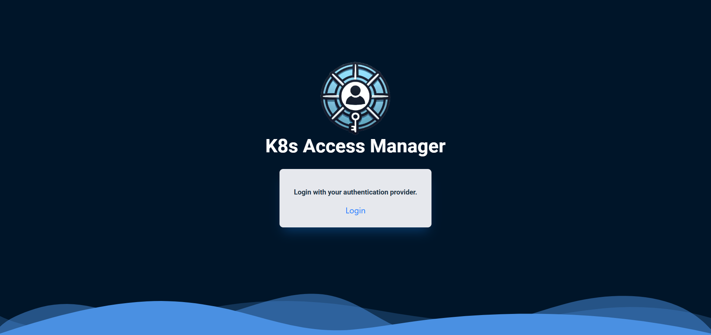

Po kliknięciu przycisku "Login" zostaniemy przekierowani do strony skonfigurowanego dostawcy tożsamości. Po zalogowaniu zostaniemy przekierowani z powrotem do aplikacji.
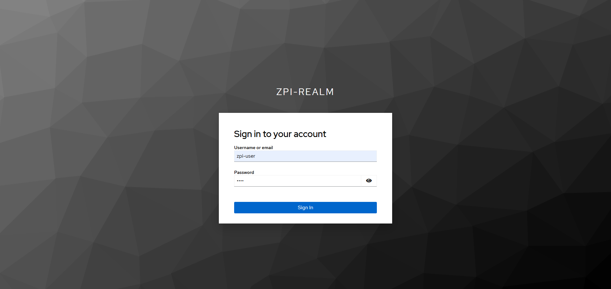

> *Przykład ekranu logowania na podstawie Keycloak* 

---

## 2. Strona główna
Po zalogowaniu zostaniemy przekierowani do strony głównej aplikacji. Po lewej stronie znajduje się menu, które pozwala na nawigację po aplikacji. Nagłówek zawiera nazwę użytkownika oraz przycisk wylogowania.
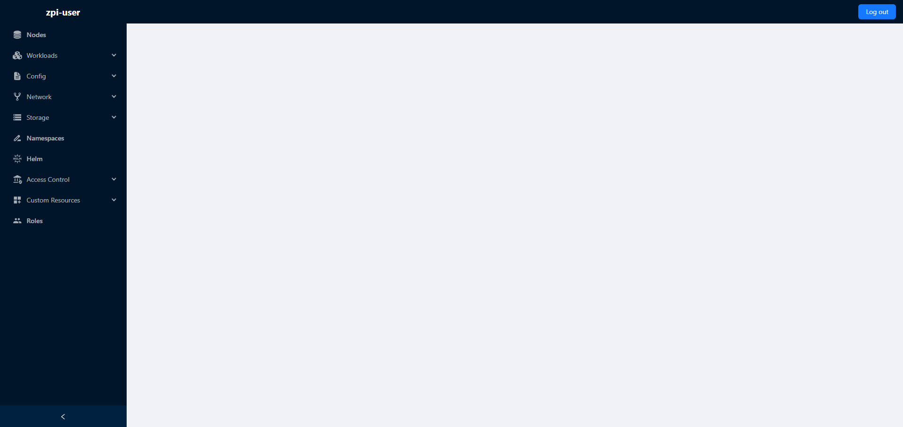

Kliknięcie przycisku w lewym dolnym rogu pozwala zminimalizować menu. Kliknięcie przycisku ponownie przywraca menu do pełnego rozmiaru.
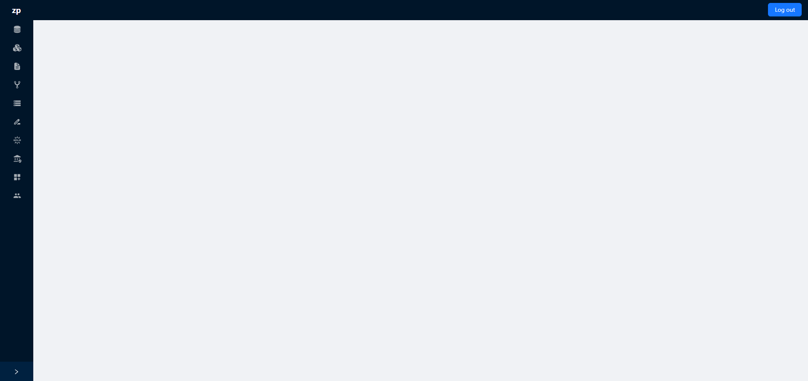

Menu w stanie zminimalizowanym nadal pozwala na nawigację po aplikacji. Po najechaniu kursorem myszy na przyciski menu, wyświetlają się nazwy przycisków. Jeżeli przycisk zawiera podmenu, to po kliknięciu na przycisk zostanie wyświetlone podmenu.
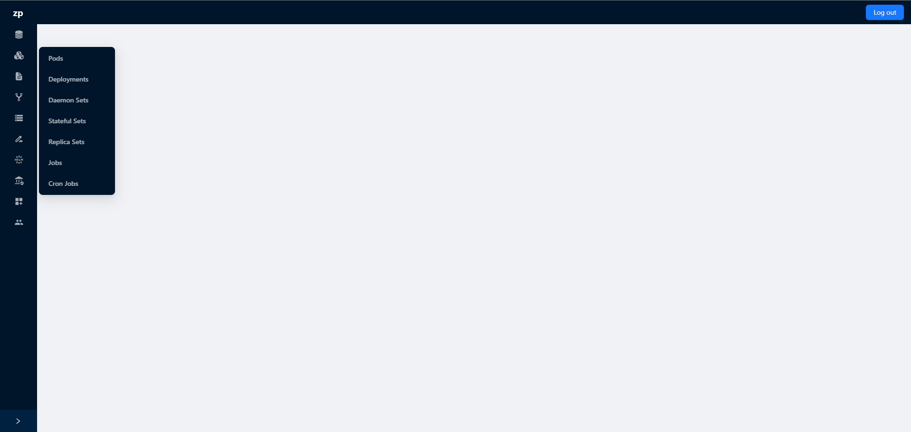

---

## 3. Zarządzanie zasobami na klastrze
Aplikacja pozwala na zarządzanie następującymi zasobami podzielonymi na kategorie:
- Nodes
- Workloads
    - Pods
    - Deployments
    - Daemon Sets
    - Stateful Sets
    - Replica Sets
    - Jobs
    - Cron Jobs
- Config
    - Config Maps
    - Secrets
- Network
    - Services
    - Ingresses
- Storage
    - Persistent Volume Claims
    - Persistent Volumes
    - Storage Classes
- Namespaces
- Access Control
    - Service Accounts
    - Cluster Roles
    - Cluster Role Bindings
- Custom Resources
    - Custom Resource Definitions

---

### 3.1. Przeglądanie zasobów
Aby wyświetlić listę zasobów, należy wybrać typ zasobu z menu. Po wybraniu typu, sprawdzone zostaną uprawnienia użytkownika do wyświetlenia zasobów. W przypadku braku uprawnień, zasoby nie zostaną wyświetlone.
Zasoby wyświetlane są w formie tabeli. Każdy wiersz tabeli reprezentuje jeden zasób. Możliwe jest wybranie liczby zasobów wyświetlanych na stronę. Domyślnie wyświetlanych jest 10 zasobów na stronę.

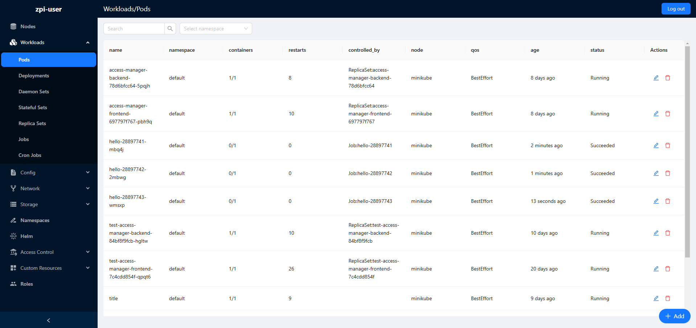

W lewym rogu, nad tabelą, znajdują się pola do filtrowania zasobów. Po wpisaniu tekstu w pole search, pozostaną tylko te zasoby, które zawierają wpisany tekst w nazwie. 
Drugie pole pozwala na wybranie namespace, z którego chcemy wyświetlić zasoby. 

Domyślnie wyświetlane są wszystkie zasoby ze wszystkich namespace'ów.

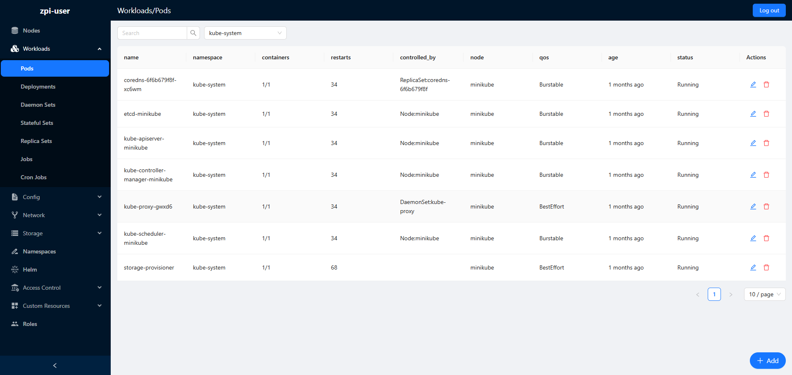
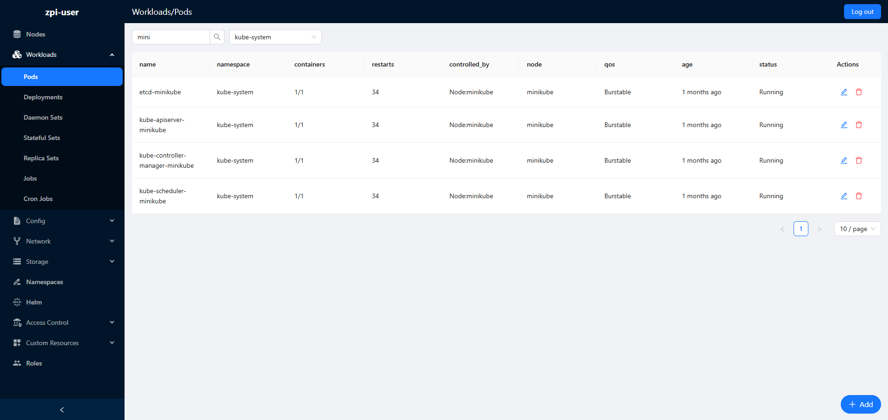

W przypadku zasobów nieposiadających namespace, pole namespace nie będzie wyświetlane.

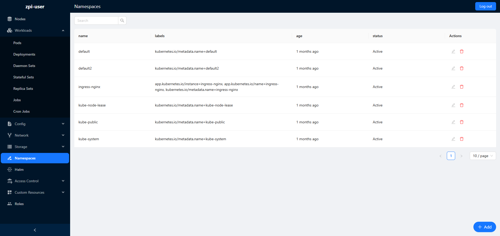

---

### 3.2. Tworzenie zasobów
Zasób można utworzyć, klikając przycisk "Add" znajdujący się w prawym dolnym rogu. Po kliknięciu przekierowani zostaniemy do edytora tekstu z domyślną konfiguracją zasobu. 
W przypadku braku uprawnień do tworzenia zasobów, przycisk "Add" będzie nieaktywny.

Po zakończeniu edycji należy kliknąć przycisk "Save" w prawym górnym rogu. Zasób zostanie utworzony na klastrze.
Aby porzucić zmiany, należy kliknąć przycisk "Back" w prawym górnym rogu.

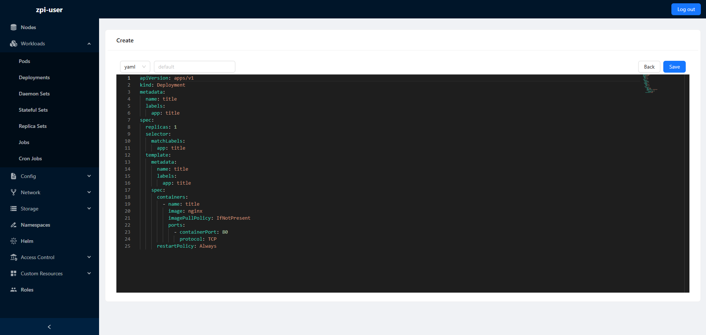

Możliwa jest zmiana formatu definicji zasobu. Domyślnie wyświetlany jest format YAML. Dostępny jest również format JSON.
Pole wyboru formatu znajduje się w lewym górnym rogu. Po wybraniu formatu edytor tekstu zostanie zaktualizowany.

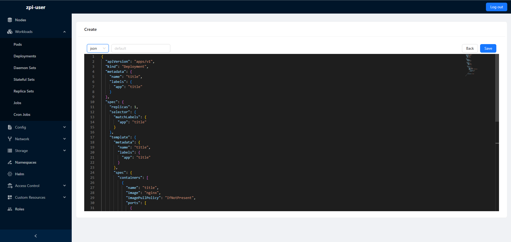

Jeżeli zasób jest namespace'owany, to widoczne będzie pole do wpisania namespace'u. 
W przypadku zasobów nieposiadających namespace, pole nie będzie wyświetlane. Domyślnie wybrany jest namespace "default".

---

### 3.3. Edycja zasobów
Zasób można edytować, klikając w pierwszą ikonę w kolumnie "Actions". Po kliknięciu przekierowani zostaniemy do edytora tekstu z konfiguracją zasobu.
W przypadku braku uprawnień do edycji zasobów, przycisk "Edit" będzie nieaktywny.

Po zakończeniu edycji należy kliknąć przycisk "Save" w prawym górnym rogu. Zasób zostanie zaktualizowany na klastrze.
Aby porzucić zmiany, należy kliknąć przycisk "Back" w prawym górnym rogu.

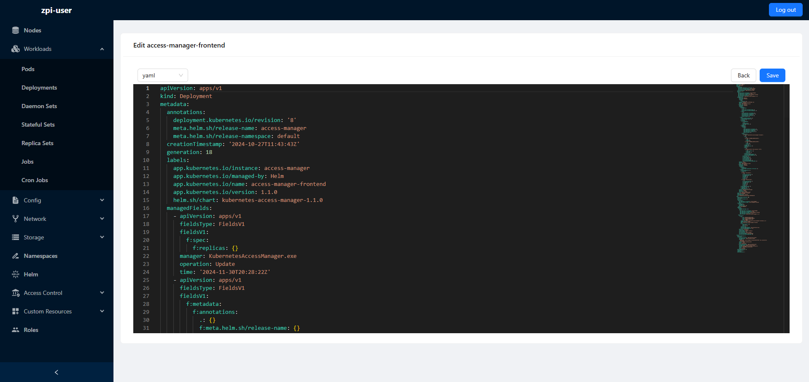

Możliwa jest zmiana formatu definicji zasobu. Domyślnie wyświetlany jest format YAML. Dostępny jest również format JSON.
Pole wyboru formatu znajduje się w lewym górnym rogu. Po wybraniu formatu edytor tekstu zostanie zaktualizowany.

---

### 3.4. Usuwanie zasobów
Zasób można usunąć, klikając w drugą ikonę w kolumnie "Actions". Po kliknięciu zostanie wyświetlone okno dialogowe z potwierdzeniem usunięcia zasobu.
W przypadku braku uprawnień do usuwania zasobów, przycisk "Delete" będzie nieaktywny.

Po potwierdzeniu zasób zostanie usunięty z klastra.

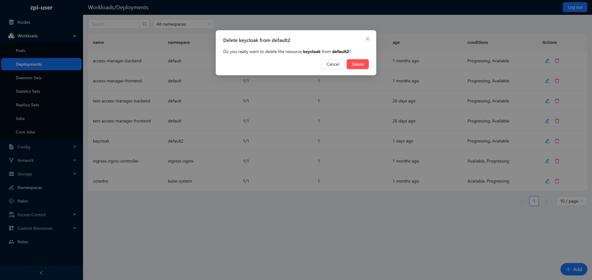

---

### 3.5. Przeglądanie szczegółów zasobu
Szczegóły zasobu można przeglądać, klikając w jakiekolwiek pole wiersza tabeli z wyjątkiem kolumny "Actions". 
Po kliknięciu z prawej strony ekranu wysunie się panel z informacjami o zasobie. Wybrany zasób będzie podświetlony na niebiesko.

Informacja reprezentowana jest na dwa sposoby: tekst lub rozwijane pole z kolejnymi szczegółami.

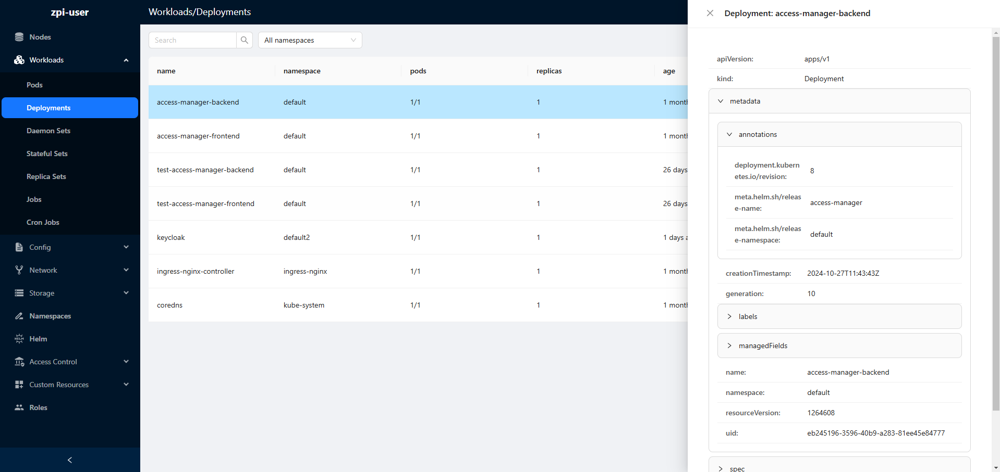

---

## 4. Zarządzanie aplikacjami Helmowymi
Aplikacja pozwala na zarządzanie aplikacjami Helmowymi. W celu zarządzania aplikacjami należy wybrać przycisk "Helm" z menu.

### 4.1. Przeglądanie aplikacji Helmowych
Aby wyświetlić listę aplikacji Helmowych, należy wybrać przycisk "Helm" z menu. Po wybraniu przycisku, sprawdzone zostaną uprawnienia użytkownika do wyświetlenia aplikacji helmowych. 
W przypadku braku uprawnień, aplikacje nie zostaną wyświetlone. Możliwe jest wybranie liczby aplikacji wyświetlanych na stronę. Domyślnie wyświetlanych jest 10 aplikacji na stronę.

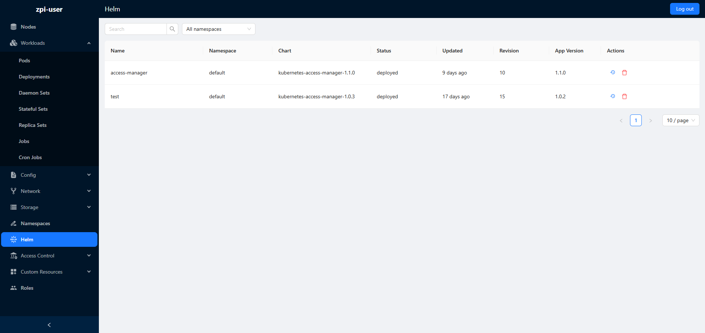

W lewym rogu, nad tabelą, znajdują się pola do filtrowania aplikacji. Po wpisaniu tekstu w pole search, pozostaną tylko te aplikacje, które zawierają wpisany tekst w nazwie.
Drugie pole pozwala na wybranie namespace, z którego chcemy wyświetlić aplikacje.

Domyślnie wyświetlane są wszystkie aplikacje ze wszystkich namespace'ów.