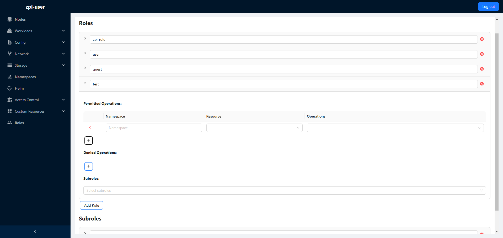

## For English Press [Here](#user-guide)

# Podręcznik użytkownika

---

## Wymagania wstępne
1. Zainstalowana i skonfigurowana aplikacja

---

## 1. Logowanie
Uruchamiamy aplikację webową. Po załadowaniu powinien być widoczny następujący ekran:

Po kliknięciu przycisku "Login" zostaniemy przekierowani do strony skonfigurowanego dostawcy tożsamości. Po zalogowaniu zostaniemy przekierowani z powrotem do aplikacji.

> *Przykład ekranu logowania na podstawie Keycloak* 

---

## 2. Strona główna
Po zalogowaniu zostaniemy przekierowani do strony głównej aplikacji. Po lewej stronie znajduje się menu, które pozwala na nawigację po aplikacji. Nagłówek zawiera nazwę użytkownika oraz przycisk wylogowania.

Kliknięcie przycisku w lewym dolnym rogu pozwala zminimalizować menu. Kliknięcie przycisku ponownie przywraca menu do pełnego rozmiaru.

Menu w stanie zminimalizowanym nadal pozwala na nawigację po aplikacji. Po najechaniu kursorem na przycisk menu wyświetli się jego nazwa. Jeżeli przycisk zawiera podmenu, to po najechaniu zostanie wyświetlone podmenu.

---

## 3. Zarządzanie zasobami na klastrze
Aplikacja pozwala na zarządzanie następującymi zasobami podzielonymi na kategorie:
- Nodes
- Workloads
    - Pods
    - Deployments
    - Daemon Sets
    - Stateful Sets
    - Replica Sets
    - Jobs
    - Cron Jobs
- Config
    - Config Maps
    - Secrets
- Network
    - Services
    - Ingresses
- Storage
    - Persistent Volume Claims
    - Persistent Volumes
    - Storage Classes
- Namespaces
- Access Control
    - Service Accounts
    - Cluster Roles
    - Cluster Role Bindings
- Custom Resources
    - Custom Resource Definitions

---

### 3.1. Przeglądanie zasobów
Aby wyświetlić listę zasobów, należy wybrać typ zasobu z menu. Po wybraniu typu, sprawdzone zostaną uprawnienia użytkownika do wyświetlenia zasobów. W przypadku braku uprawnień, zasoby nie zostaną wyświetlone.
Zasoby wyświetlane są w formie tabeli. Każdy wiersz tabeli reprezentuje jeden zasób. Możliwe jest wybranie liczby zasobów wyświetlanych na stronę. Domyślnie wyświetlanych jest 10 zasobów na stronę.

W lewym rogu, nad tabelą, znajdują się pola do filtrowania zasobów. Po wpisaniu tekstu w pole search, pozostaną tylko te zasoby, które zawierają wpisany tekst w nazwie. 
Drugie pole pozwala na wybranie namespace, z którego chcemy wyświetlić zasoby. 

Domyślnie wyświetlane są wszystkie zasoby ze wszystkich namespace'ów.

W przypadku zasobów nieposiadających namespace, pole namespace nie będzie wyświetlane.

---

### 3.2. Tworzenie zasobów
Zasób można utworzyć, klikając przycisk "Add" znajdujący się w prawym dolnym rogu. Po kliknięciu przekierowani zostaniemy do edytora tekstu z domyślną konfiguracją zasobu. 
W przypadku braku uprawnień do tworzenia zasobów, przycisk "Add" będzie nieaktywny.

Po zakończeniu edycji należy kliknąć przycisk "Save" w prawym górnym rogu. Zasób zostanie utworzony na klastrze.
Aby porzucić zmiany, należy kliknąć przycisk "Back" w prawym górnym rogu.

Możliwa jest zmiana formatu definicji zasobu. Domyślnie wyświetlany jest format YAML. Dostępny jest również format JSON.
Pole wyboru formatu znajduje się w lewym górnym rogu. Po wybraniu formatu edytor tekstu zostanie zaktualizowany.

Jeżeli zasób jest namespace'owany, to widoczne będzie pole do wpisania namespace'u. 
W przypadku zasobów nieposiadających namespace, pole nie będzie wyświetlane. Domyślnie wybrany jest namespace "default".

---

### 3.3. Edycja zasobów
Zasób można edytować, klikając w pierwszą ikonę w kolumnie "Actions". Po kliknięciu przekierowani zostaniemy do edytora tekstu z konfiguracją zasobu.
W przypadku braku uprawnień do edycji zasobów, przycisk "Edit" będzie nieaktywny.

Po zakończeniu edycji należy kliknąć przycisk "Save" w prawym górnym rogu. Zasób zostanie zaktualizowany na klastrze.
Aby porzucić zmiany, należy kliknąć przycisk "Back" w prawym górnym rogu.

Możliwa jest zmiana formatu definicji zasobu. Domyślnie wyświetlany jest format YAML. Dostępny jest również format JSON.
Pole wyboru formatu znajduje się w lewym górnym rogu. Po wybraniu formatu edytor tekstu zostanie zaktualizowany.

---

### 3.4. Usuwanie zasobów
Zasób można usunąć, klikając w drugą ikonę w kolumnie "Actions". Po kliknięciu zostanie wyświetlone okno dialogowe z potwierdzeniem usunięcia zasobu.
W przypadku braku uprawnień do usuwania zasobów, przycisk "Delete" będzie nieaktywny.

Po potwierdzeniu zasób zostanie usunięty z klastra.

---

### 3.5. Przeglądanie szczegółów zasobu
Szczegóły zasobu można przeglądać, klikając w jakiekolwiek pole wiersza tabeli z wyjątkiem kolumny "Actions". 
Po kliknięciu z prawej strony ekranu wysunie się panel z informacjami o zasobie. Wybrany zasób będzie podświetlony na niebiesko.

Informacja reprezentowana jest na dwa sposoby: tekst lub rozwijane pole z kolejnymi szczegółami.

---

## 4. Zarządzanie aplikacjami Helmowymi
Aplikacja pozwala na zarządzanie aplikacjami Helmowymi. W celu zarządzania aplikacjami należy wybrać przycisk "Helm" z menu.

---

### 4.1. Przeglądanie aplikacji Helmowych
Aby wyświetlić listę aplikacji Helmowych, należy wybrać przycisk "Helm" z menu. Po wybraniu przycisku, sprawdzone zostaną uprawnienia użytkownika do wyświetlenia aplikacji helmowych. 
W przypadku braku uprawnień, aplikacje nie zostaną wyświetlone. Możliwe jest wybranie liczby aplikacji wyświetlanych na stronę. Domyślnie wyświetlanych jest 10 aplikacji na stronę.

W lewym rogu, nad tabelą, znajdują się pola do filtrowania aplikacji. Po wpisaniu tekstu w pole search, pozostaną tylko te aplikacje, które zawierają wpisany tekst w nazwie.
Drugie pole pozwala na wybranie namespace, z którego chcemy wyświetlić aplikacje.

Domyślnie wyświetlane są wszystkie aplikacje ze wszystkich namespace'ów.

---

### 4.2. Przywracanie poprzednich wersji aplikacji Helmowych
Aplikacja pozwala na przywrócenie poprzednich wersji aplikacji Helmowych. Aby przywrócić poprzednią wersję, należy kliknąć pierwszy przycisk w kolumnie "Actions".
W przypadku braku uprawnień do przywracania poprzednich wersji przycisk będzie nieaktywny.

Po kliknięciu zostanie wyświetlone okno dialogowe z polem do wpisania numeru wersji. Po wpisaniu numeru wersji i potwierdzeniu, zostanie przywrócona poprzednia wersja aplikacji.

Jeżeli operacja potrwa dłużej niż 5 sekund, okno zostanie zamknięte, a operacja zostanie wykonana w tle.

---

### 4.3. Odinstalowywanie aplikacji Helmowych
Aplikację Helmową można odinstalować, klikając w drugą ikonę w kolumnie "Actions". Po kliknięciu zostanie wyświetlone okno dialogowe z potwierdzeniem odinstalowania aplikacji.
W przypadku braku uprawnień do odinstalowania aplikacji, przycisk będzie nieaktywny.

Po potwierdzeniu aplikacja zostanie odinstalowana z klastra.

Jeżeli operacja potrwa dłużej niż 5 sekund, okno zostanie zamknięte, a operacja zostanie wykonana w tle.

---

### 4.4. Przeglądanie szczegółów aplikacji Helmowej
Szczegóły aplikacji Helmowej można przeglądać, klikając w jakiekolwiek pole wiersza tabeli z wyjątkiem kolumny "Actions".
Po kliknięciu z prawej strony ekranu wysunie się panel z informacjami o aplikacji. Wybrana aplikacja będzie podświetlona na niebiesko.

Dla aplikacji Helmowej szczegóły podzielone są na 2 zakładki: "Release" oraz "History".

---

## 5. Zarządzanie uprawnieniami
Aplikacja pozwala na zarządzanie poziomem dostępu użytkowników poprzez przypisywanie uprawnień rolom uzyskanym od dostawcy tożsamości.

Służy do tego zakładka "Roles" umieszona u dołu menu. Po wybraniu zakładki, sprawdzone zostaną uprawnienia użytkownika do wyświetlania szczegółów oraz edycji ConfigMapy zawierającej mapowanie ról i uprawnień.

---

### 5.1. Przeglądanie ról
Aby wyświetlić listę ról, należy wybrać przycisk "Roles" z menu. Po kliknięciu sprawdzone zostaną uprawnienia użytkownika do wyświetlenia ról.
W przypadku braku uprawnień niemożliwe będzie kliknięcie przycisku "Roles".

Poniżej kolejno widok bez uprawnień oraz widok z uprawnieniami.

---

### 5.2. Szczegóły roli
Szczegóły roli można rozwinąć, klikając w jakąkolwiek część jej pola. Kliknięcie innej roli spowoduje zwinięcie wcześniej rozwiniętej roli.

Role i podrole traktowane są osobno. Wyświetlenie szczegółów roli nie spowoduje zwinięcia szczegółów podroli.

Każda z ról dzielić się może na 3 sekcje: 
- "Permitted Operations" zawiera operacje, które użytkownik może wykonać.
- "Denied Operations" zawiera operacje, które użytkownik nie może wykonać.
- "Subroles" zawiera podrole, po których dziedziczy dana rola.

Kategorie nie są wyświetlane, jeżeli nie zawierają żadnych danych.

Kliknięcie jednej z podroli w sekcji "Subroles" spowoduje rozwinięcie szczegółów tej podroli i przejście do niej.
Pomiędzy kliknięciem a rozwinięciem podroli może nastąpić opóźnienie.

Uprawnienia w kategoriach "Permitted Operations" oraz "Denied Operations" mogą być sortowane według namespace oraz typu zasobu.

Możliwe jest również filtrowanie uprawnień na podstawie operacji. 
Po kliknięciu ikony po prawej stronie kolumny "Operations" zostanie wyświetlone pole do wybrania operacji. Po wybraniu zostaną wyświetlone tylko te uprawnienia, które zawierają wybraną operację.

---

### 5.3. Edycja ról
Aby przejść do edycji roli, należy kliknąć przycisk "Edit Roles". Po kliknięciu zostaniemy przekierowani do formularza edycji ról.

W formularzu edycji ról możliwe jest dodawanie nowych ról, usuwanie oraz edycja istniejących ról.

Zmiany zapisać można klikając przycisk "Save". Aby porzucić zmiany, należy kliknąć przycisk "Cancel" i potwierdzić.

---

#### Dodawanie, usuwanie i edycja ról

Aby dodać nową rolę, należy kliknąć przycisk "Add Role". Po kliknięciu zostanie dodana nowa, pusta rola.
Jeżeli rola nie posiada nazwy, nie zostanie zapisana.

W ten sam sposób można dodawać nowe podrole. Wystarczy kliknąć "Add Subrole".

---

#### Usuwanie ról

Aby usunąć rolę, należy kliknąć czerwony przycisk "X" po prawej stronie nazwy roli.

---

#### Zmiana nazwy roli

Aby zmienić nazwę roli, wystarczy kliknąć w pole tekstowe i wpisać nową nazwę.

---

#### Dodawanie uprawnień do roli

Aby dodać uprawnienie do roli, należy kliknąć przycisk "+" w sekcji "Permitted Operations" lub "Denied Operations". Po kliknięciu zostanie dodane nowe pole do wpisania uprawnienia.

Domyślnie wprowadzone są puste pola. Odpowiada to przyznaniu wszystkich uprawnień dla wszystkich typów zasobów we wszystkich namespace'ach.

---

#### Modyfikoanie uprawnień

Namespace wybrać można za pomocą pola tekstowego. Wpisanie "*" lub pozostawienie pustego pola oznacza wszystkie namespace'y.

Typ zasobu wybrać można za pomocą rozwijanej listy. Możliwe do wybrania są wszystkie typy zasobów dostępne w aplikacji oraz "Helm".

Operację wybrać można za pomocą rozwijanej listy. Możliwe do wybrania są wszystkie operacje dostępne dla danego typu zasobu.

W przypadku wybrania wszystkich operacji po kolei wybór zostanie zmieniony na "All".

---

#### Usuwanie uprawnień

Aby usunąć uprawnienie, należy kliknąć czerwony przycisk "X" po lewej stronie uprawnienia.

---

#### Przypisywanie podroli

Aby przypisać podrole do roli, należy kliknąć pole "Select subroles" w sekcji "Subroles". Po kliknięciu zostanie wyświetlone rozwijane pole z dostępnymi podrolami.

Możliwe jest również ręczne wpisanie nazwy podroli. Wpisanie nazwy, która nie istnieje, przypiszę ją do roli. Będzie jednak oznaczona kolorem czerwonym i nie będzie miała znaczenia dla uprawnień.

---

<h1 id="user-guide">User Guide</h1>

---

## Prerequisites
1. Installed and configured application

---

## 1. Logining in
Run the web application. After loading, the following screen should be visible:

After clicking the "Login" button, you will be redirected to the configured identity provider’s login page. Once you have logged in, you will be redirected back to the application.

> *Example login screen based on Keycloak*

---

## 2. Home page
After logging in, you will be redirected to the main page of the application. On the left side, there is a menu that allows you to navigate through the application. The header contains the username and the logout button.

Clicking the button in the lower left corner allows you to minimize the menu. Clicking the button again will restore the menu to full size.

In the minimized state, the menu still allows navigation through the application. Hovering the mouse cursor over the menu button displays it's name. If a button contains a submenu, hovering over it will display the submenu.

---

## 3. Managing resources on the cluster
The application allows you to manage the following resources divided into categories:
- Nodes
- Workloads
  - Pods
  - Deployments
  - Daemon Sets
  - Stateful Sets
  - Replica Sets
  - Jobs
  - Cron Jobs
- Config
  - Config Maps
  - Secrets
- Network
  - Services
  - Ingresses
- Storage
  - Persistent Volume Claims
  - Persistent Volumes
  - Storage Classes
- Namespaces
- Access Control
  - Service Accounts
  - Cluster Roles
  - Cluster Role Bindings
- Custom Resources
  - Custom Resource Definitions

---

### 3.1. Listing resources
To display a list of resources, select the resource type from the menu. After selecting the type, the user’s permissions to view those resources will be checked. If you do not have the proper permissions, the resources will not be displayed.

Resources are displayed in a table format. Each row of the table represents one resource. You can select how many resources to display per page. By default, 10 resources are displayed per page.

In the upper left corner, above the table, there are fields for filtering resources. After entering text in the search field, only those resources that contain the entered text in the name will remain.
The second field allows you to select the namespace from which you want to display resources.

By default, all resources from all namespaces are displayed.

For non-namespaced resources, the namespace field will not be displayed.

---

### 3.2. Creating resources
You can create a resource by clicking the "Add" button in the lower right corner. After clicking, you will be redirected to a text editor with the default resource configuration.
If you do not have permissions to create resources, the "Add" button will be inactive.

After editing, click the "Save" button in the upper right corner. The resource will be created on the cluster.
To discard changes, click the "Back" button in the upper right corner.

You can change the resource definition format. By default, the YAML format is displayed. The JSON format is also available.
The format selection field is located in the upper left corner. After selecting the format, the text editor will be updated.

If the resource is namespaced, a field for entering the namespace will be visible.
For non-namespaced resources, the field will not be displayed. The "default" namespace is selected by default.

---

### 3.3. Editing resources
You can edit a resource by clicking the first icon in the "Actions" column. After clicking, you will be redirected to a text editor with the resource's configuration.
If you do not have permissions to edit resources, the "Edit" button will be inactive.

After editing, click the "Save" button in the upper right corner. The resource will be updated on the cluster.
To discard changes, click the "Back" button in the upper right corner.

You can change the resource definition format. By default, the YAML format is displayed. The JSON format is also available.
The format selection field is located in the upper left corner. After selecting the format, the text editor will be updated.

---

### 3.4. Deleting resources
You can delete a resource by clicking the second icon in the "Actions" column. After clicking, a confirmation dialog will be displayed.
If you do not have permissions to delete resources, the "Delete" button will be inactive.

After confirmation, the resource will be deleted from the cluster.

---

### 3.5. Viewing resource details
You can view the details of a resource by clicking on any field in the table row except the "Actions" column.
After clicking, a panel with information about the resource will slide out from the right side of the screen. The selected resource will be highlighted in blue.

Information is represented in two ways: text or an expandable field with more details.

---

## 4. Managing Helm releases
The application allows you to manage Helm releases. To manage releases, select the "Helm" button from the menu.

---

### 4.1. Listing Helm releases
To display a list of Helm releases, select the "Helm" button from the menu. After clicking, the user's permissions to view Helm releases will be checked.
If you do not have permissions, the Helm releases will not be displayed. You can select how many releases to display per page. By default, 10 releases are displayed per page.

In the upper left corner, above the table, there are fields for filtering releases. After entering text in the search field, only those releases that contain the entered text in the name will remain.
The second field allows you to select the namespace from which you want to display releases.

By default, all releases from all namespaces are displayed.

---

### 4.2. Rollback Helm releases
The application allows you to rollback Helm releases. To rollback a release, click the first button in the "Actions" column.
If you do not have permissions to rollback releases, the button will be inactive.

After clicking, a dialog box will be displayed with a field to enter the release version. After entering the version number and confirming, the previous version of the release will be restored.

If the operation takes longer than 5 seconds, the dialog box will be closed, and the operation will be performed in the background.

---

### 4.3. Uninstalling Helm releases
You can uninstall a Helm release by clicking the second icon in the "Actions" column. After clicking, a confirmation dialog will be displayed.
If you do not have permissions to uninstall releases, the button will be inactive.

After confirmation, the release will be uninstalled from the cluster.

If the operation takes longer than 5 seconds, the dialog box will be closed, and the operation will be performed in the background.

---

### 4.4. Viewing Helm release details
You can view the details of a Helm release by clicking on any field in the table row except the "Actions" column.
After clicking, a panel with information about the release will slide out from the right side of the screen. The selected release will be highlighted in blue.

For Helm releases, the details are divided into 2 tabs: "Release" and "History".

---

## 5. Managing permissions
The application allows you to manage user access levels by assigning permissions to roles obtained from the identity provider.

This is done via the "Roles" tab at the bottom of the menu. After selecting this tab, the system will check the user’s permissions to display and edit the ConfigMap containing the role-to-permission mappings.

---

### 5.1. Listing roles
To display a list of roles, select the "Roles" button from the menu. After clicking, the user's permissions to view roles will be checked.
If you do not have permissions, the "Roles" button will not be clickable.

Below are the views without permissions and with permissions.

---

### 5.2. Role details
You can expand the details of a role by clicking on any part of its field. Clicking on another role will collapse the previously expanded role.

Roles and subroles are treated separately. Displaying the details of a role will not collapse the details of a subrole.

Each role can be divided into 3 sections:
- "Permitted Operations" contains operations that the user can perform.
- "Denied Operations" contains operations that the user cannot perform.
- "Subroles" contains subroles that the role inherits from.

Categories are not displayed if they do not contain any data.

Clicking on one of the subroles in the "Subroles" section will expand the details of that subrole and navigate to it.
There may be a delay between clicking and expanding the subrole.

Permissions in the "Permitted Operations" and "Denied Operations" categories can be sorted by namespace and resource type.

Permissions can also be filtered based on the operation.
Clicking the icon on the right side of the "Operations" column will display a field to select the operation. After selecting, only permissions containing the selected operation will be displayed.

---

### 5.3. Editing roles
