## For English Press [Here](#installation-and-configuration-guide-for-keycloak-in-kubernetes-user-manager) / Для русского нажмите [здесь](#инструкция-по-установке-и-настройке-keycloak-для-kubernetes-user-manager)
# Instrukcja instalacji i konfiguracji Keycloak dla Kubernetes User Manager

## Wymagania wstępne
- Zainstalowany Docker.

---

## 1. Uruchomienie Keycloak
Uruchamiamy kontener Dockera komendą:

```bash
docker run -d -p {outside_port}:8080 \
  -e KC_BOOTSTRAP_ADMIN_USERNAME={admin_username} \
  -e KC_BOOTSTRAP_ADMIN_PASSWORD={admin_password} \
  quay.io/keycloak/keycloak:26.0.1 start-dev
```
### Wyjaśnienie parametrów:
- `-d`: Uruchamia kontener w tle.
- `-p {outside_port}:8080`: Mapowanie portu 8080 z kontenera na port skonfigurowany port na maszynie lokalnej.
- `-e KC_BOOTSTRAP_ADMIN_USERNAME`: Ustawia nazwę użytkownika administratora.
- `-e KC_BOOTSTRAP_ADMIN_PASSWORD`: Ustawia hasło administratora.
- `quay.io/keycloak/keycloak:26.0.1`: Wskazuje obraz Dockera w konkretnej wersji (26.0.1).
- `start-dev`: Tryb developerski Keycloak.
### Przykładowa konfiguracja
```bash
docker run -d -p 4000:8080 \
  -e KC_BOOTSTRAP_ADMIN_USERNAME=admin \
  -e KC_BOOTSTRAP_ADMIN_PASSWORD=admin \
  quay.io/keycloak/keycloak:26.0.1 start-dev
```

---

## 2. Logowanie do Keycloak
- Otwieramy przeglądarkę i przechodzimy pod adres, w przypadku przykładowej konfiguracji `http://localhost:4000`.
- Logujemy się przy użyciu danych, w przypadku przykładowej konfiguracji dane to:
    - Username: `admin`
    - Password: `admin`

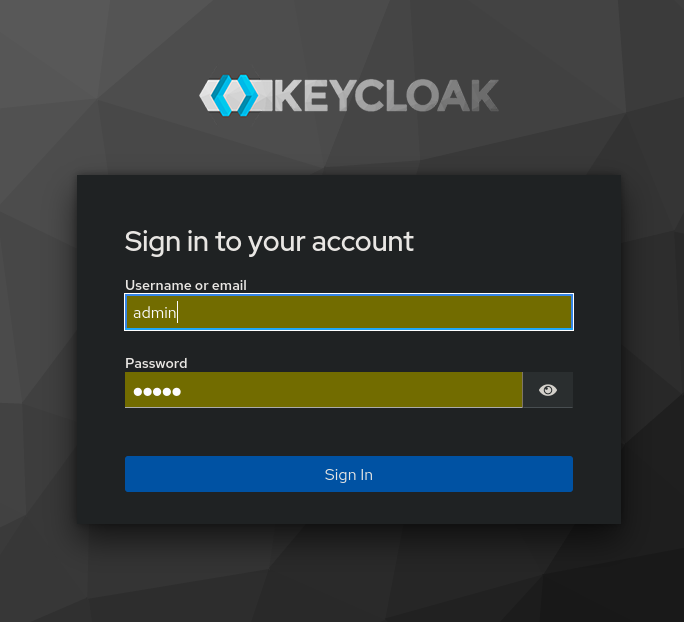

---

## 3. Tworzenie Realm
1. Klikamy **Keycloak Master** w lewym górnym rogu.
2. Wybieramy opcję **Create realm**.

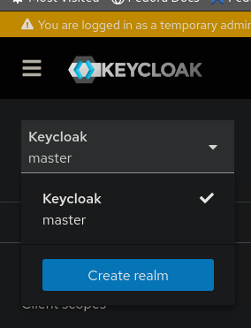

---

## 4. Konfiguracja Realm
1. Podajemy nazwę Realm, np. `ZPI-realm`.
2. Zostawiamy pozostałe opcje domyślne i klikamy **Save**.

---

## 5. Tworzenie klienta
1. Przechodzimy do **Manage → Clients**.
2. Klikamy **Create client**.

   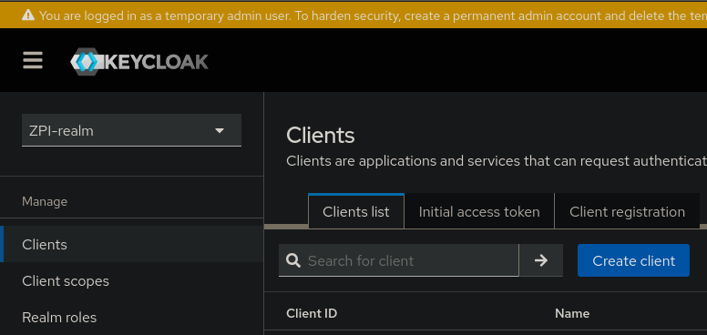
3. Podajemy nazwę klienta, np. `ZPI-client` i klikamy **Next**.

   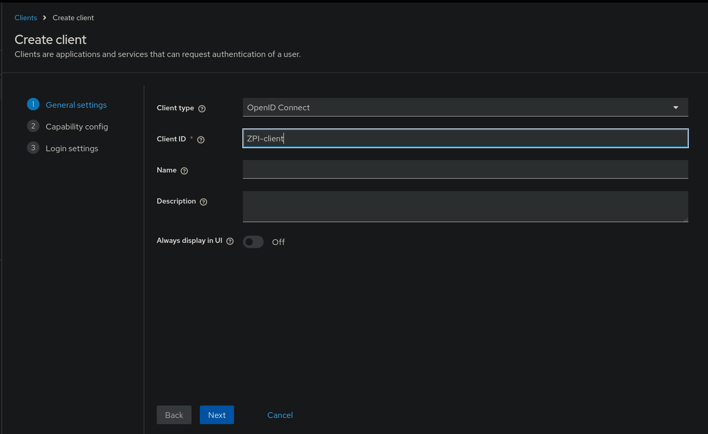
4. Pozostawiamy wartości domyślne i klikamy **Next**.

   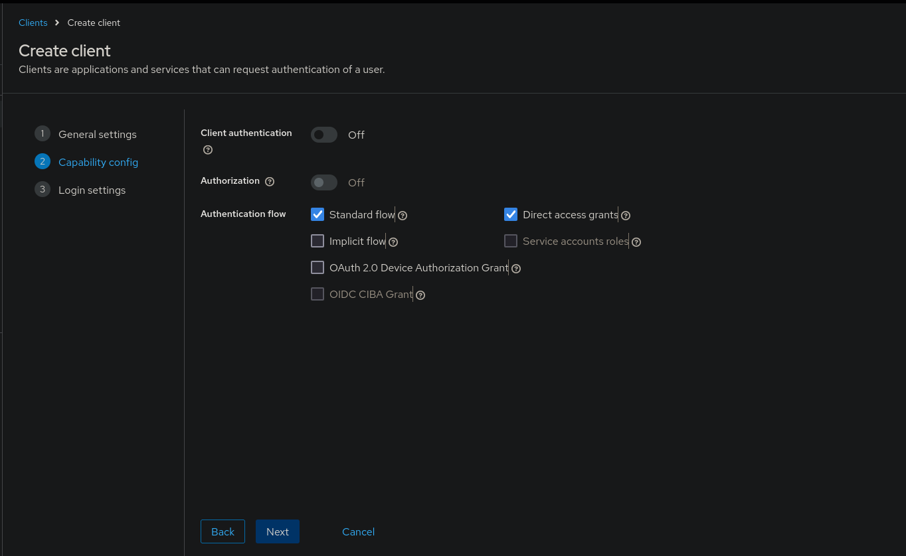

   > **Uwaga**: Można także włączyć autoryzację oraz autentykację (Client authentication → **On** oraz Authorization → **On**). 
   > W takim przypadku konieczne będzie dodanie zmiennej środowiskowej `VITE_KEYCLOAK_CLIENT_SECRET` przechowującą sekret klienta.

5. W sekcji **Valid redirect URIs**, **Valid post logout redirect URIs** oraz **Web origins** wpisujemy `*` (dla celów testowych) i klikamy **Save**.
   > **Uwaga**: W środowisku produkcyjnym należy podać konkretne adresy URL aplikacji, np. `https://example.com/*`.
   
   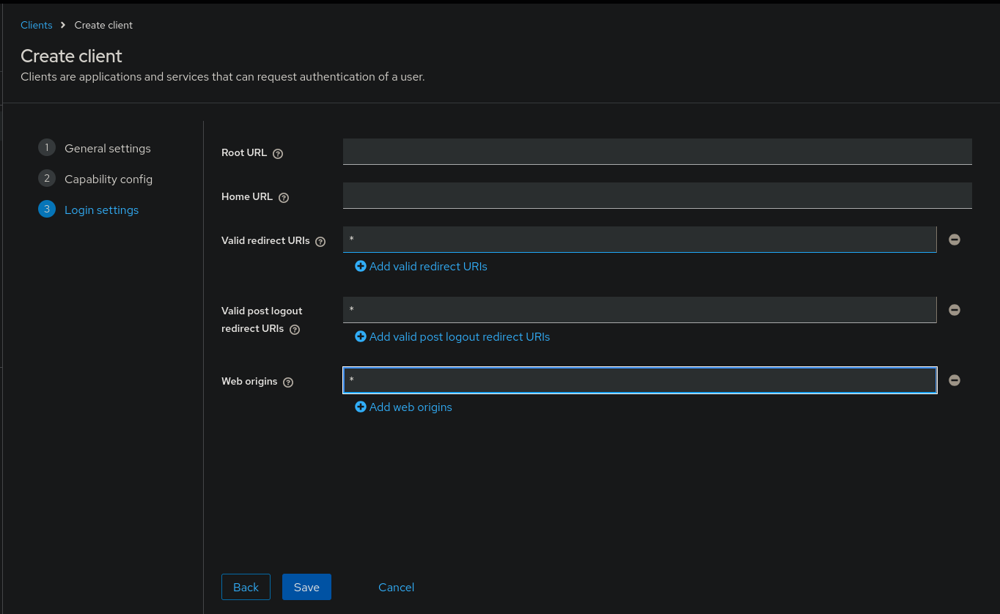


---

## 6. Tworzenie użytkownika
1. Przechodzimy do **Manage → Users**.
2. Klikamy **Create new user**.

   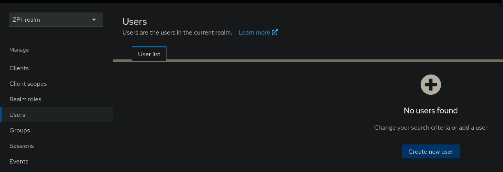
3. Podajemy nazwę użytkownika, np. `zpi-user`. Opcjonalnie można dodać adres e-mail, imię i nazwisko.

   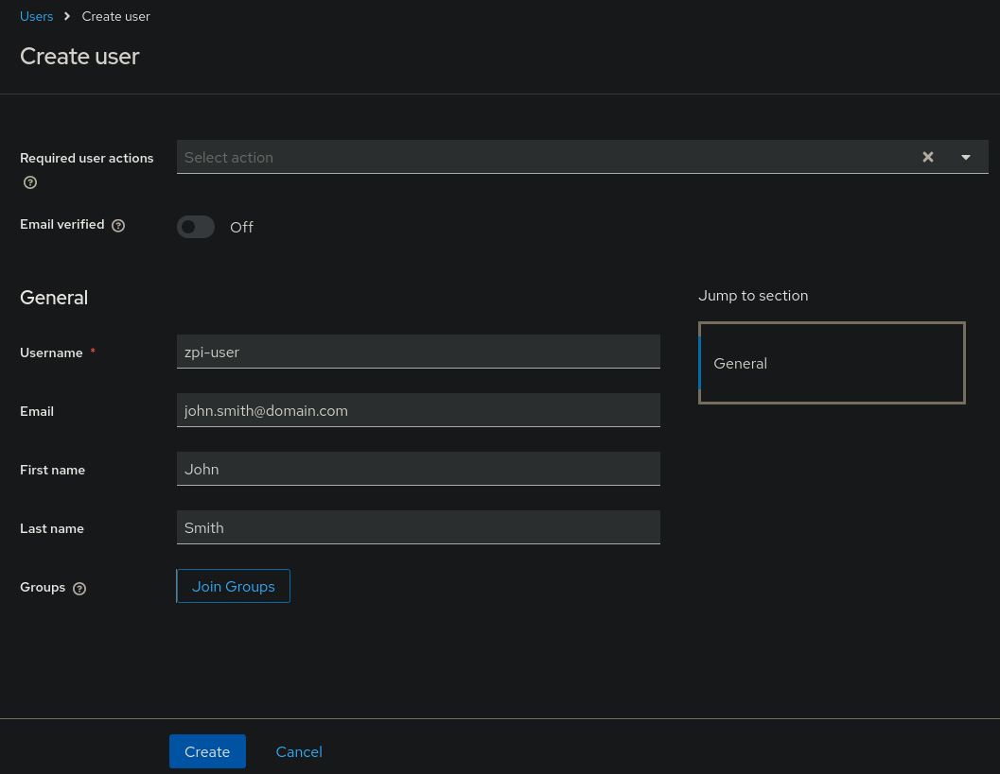
4. Przechodzimy do zakładki **Credentials**, klikamy **Set password**.

   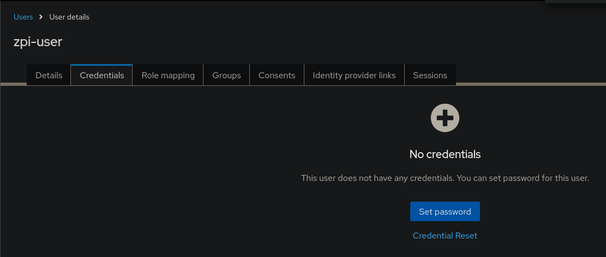
5. Ustawiamy hasło i, jeżeli nie chcemy wymuszać zmiany hasła przy pierwszym logowaniu, odznaczamy przełącznik **Temporary**.

---

## 7. Tworzenie ról
Aby rola działała poprawnie, wystarczy dodać ją w jednym z tych miejsc – albo jako rolę Realm, albo jako rolę Klienta. 
Dodanie roli w obu miejscach jednocześnie nie jest konieczne!

### 7.1 Role Realm
1. Przechodzimy do **Manage → Realm roles**.
2. Klikamy **Create role**.

   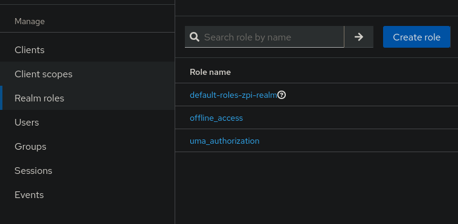
3. Podajemy nazwę roli, np. `zpi-role` i klikamy **Save**.

### 7.2 Role Klienta
1. Przechodzimy do **Manage → Clients → [nazwa klienta] → Roles**.

   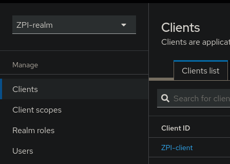
2. Klikamy **Create role**.

   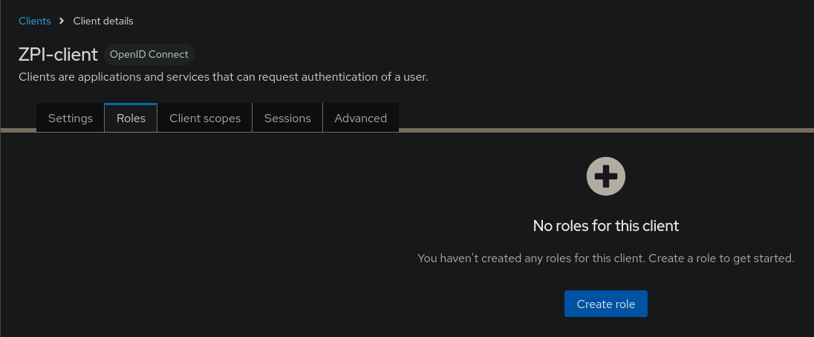
3. Podajemy nazwę roli, np. `zpi-role` i klikamy **Save**.
> **Uwaga**: Nazwa roli musi odpowiadać nazwie w konfiguracji mapy uprawnień aplikacji, aby rola nadawała odpowiednie uprawnienia.

---

## 8. Przypisywanie ról użytkownikowi
1. Przechodzimy do **Manage → Users → [nazwa użytkownika]**.

   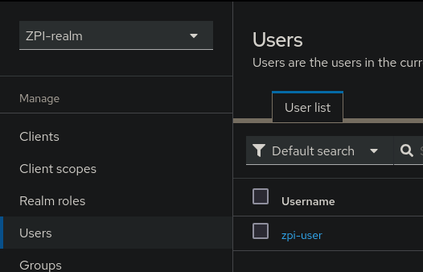
2. Wybieramy zakładkę **Role mapping** i klikamy **Assign role**.

   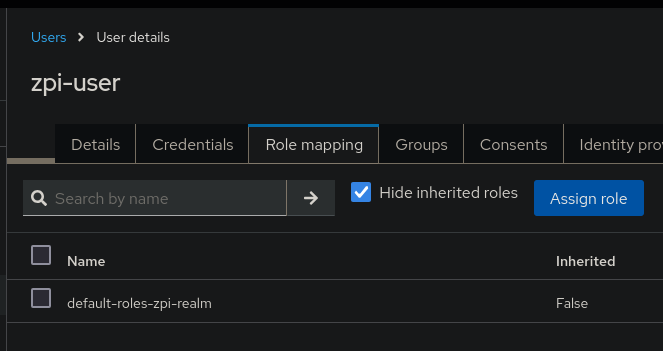
    - Jeżeli rola jest realmowa, wybieramy **Filter by realm roles** i przypisujemy odpowiednią rolę.

      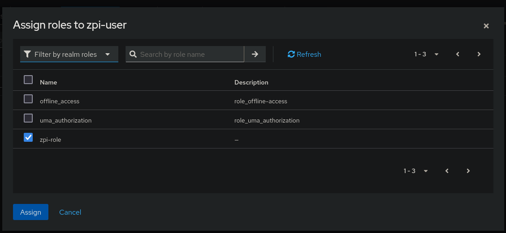
    - Jeżeli rola jest kliencka, wybieramy **Filter by clients**, wybieramy klienta i przypisujemy rolę.

   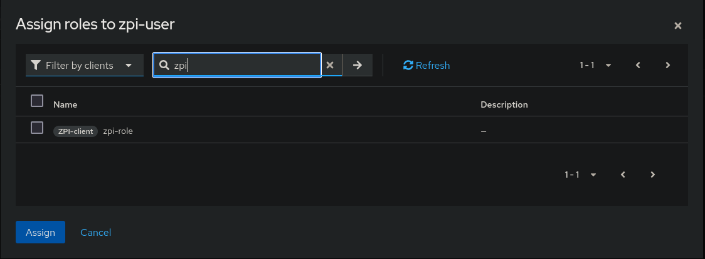

> Można użyć pola wyszukiwania obok filtrów, aby szybko znaleźć rolę.

---

## 9. Konfiguracja zmiennych środowiskowych
Zmienne środowiskowe niezbęne do zaimportowania w związku z Keycloackiem to:
```env
VITE_KEYCLOAK_URL=http://{adres-keycloak}:{port-keycloak}
VITE_KEYCLOAK_CLIENT_NAME={nazwa-clienta}
VITE_KEYCLOAK_REALM_NAME={nazwa-realm}
```
W przypadku przykładowej konfiguracji będzie to:
```env
VITE_KEYCLOAK_URL=http://localhost:4000
VITE_KEYCLOAK_CLIENT_NAME=ZPI-client
VITE_KEYCLOAK_REALM_NAME=ZPI-realm
```
> W przypadku włączenia autentykacji dla client'a musimy podać również jego secret w zmiennej środowiskowe 
> `VITE_KEYCLOAK_CLIENT_SECRET`. W tym celu przechodzimy do **Manage → Clients → [nazwa client'a] → Credentials** i
>  kopiujemy wartość dostępną pod **Client Secret**.
> 
>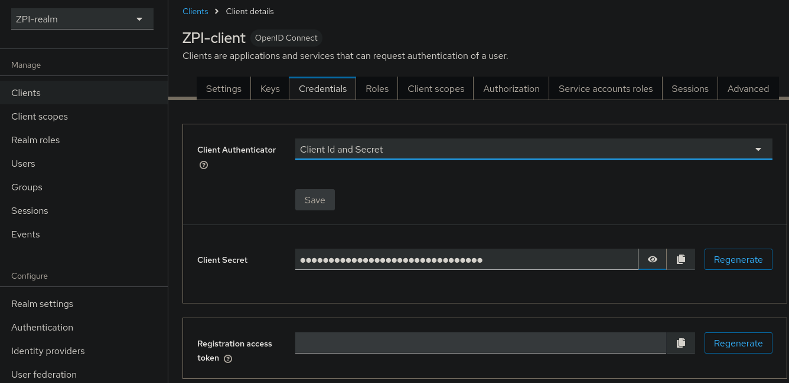

Korzystając z plików `.env` trzeba dodać je w dwóch różnych miejscach zarówno dla backendu jak i frontendu:
##### Backend (`KuberbetesUserManager/backend/.env`)
##### Frontend (`KuberbetesUserManager/frontend/.env`)

---

## 10. Testowanie aplikacji
Po poprawnej konfiguracji aplikacja powinna działać bez problemów.

# Installation and Configuration Guide for Keycloak in Kubernetes User Manager

## Prerequisites
- Docker installed.

---

## 1. Starting Keycloak
Start the Keycloak container with the following command:

```bash
docker run -d -p {outside_port}:8080 \
  -e KC_BOOTSTRAP_ADMIN_USERNAME={admin_username} \
  -e KC_BOOTSTRAP_ADMIN_PASSWORD={admin_password} \
  quay.io/keycloak/keycloak:26.0.1 start-dev
```
### Explanation of parameters:
- `-d`: Runs the container in the background.
- `-p {outside_port}:8080`: Maps port 8080 from the container to the specified port on the host machine.
- `-e KC_BOOTSTRAP_ADMIN_USERNAME`: Sets the admin username.
- `-e KC_BOOTSTRAP_ADMIN_PASSWORD`: Sets the admin password.
- `quay.io/keycloak/keycloak:26.0.1`: Specifies the Docker image (version 26.0.1).
- `start-dev`: Runs Keycloak in development mode.

### Example configuration
```bash
docker run -d -p 4000:8080 \
  -e KC_BOOTSTRAP_ADMIN_USERNAME=admin \
  -e KC_BOOTSTRAP_ADMIN_PASSWORD=admin \
  quay.io/keycloak/keycloak:26.0.1 start-dev
```

---

## 2. Logging into Keycloak
- Open a web browser and navigate to the configured address. For the example configuration, use `http://localhost:4000`.
- Log in with the credentials set earlier. For the example configuration:
    - Username: `admin`
    - Password: `admin`


---

## 3. Creating a Realm
1. Click **Keycloak Master** in the top-left corner.
2. Select **Create realm**.

   

---

## 4. Configuring the Realm
1. Enter a Realm name, e.g., `ZPI-realm`.
2. Leave other options as default and click **Save**.

---

## 5. Creating a Client
1. Navigate to **Manage → Clients**.
2. Click **Create client**.

   
3. Enter a client name, e.g., `ZPI-client`, and click **Next**.

   
4. Leave the default values and click **Next**.

   

   > **Note**: You can also enable authorization and authentication (Client authentication → **On** and Authorization → **On**).
   > In this case, it will be necessary to add the environment variable `VITE_KEYCLOAK_CLIENT_SECRET` containing the client secret.

5. In the **Valid redirect URIs**, **Valid post logout redirect URIs**, and **Web origins** sections, enter `*` (for testing purposes) and click **Save**.

   > **Note**: In a production environment, specific application URLs must be provided, e.g., `https://example.com/*`.

   

---

## 6. Creating a User
1. Navigate to **Manage → Users**.
2. Click **Create new user**.

   
3. Enter the username, e.g., `zpi-user`. Optionally, add an email, first name, and last name.

   
4. Go to the **Credentials** tab, click **Set password**.

   
5. Set a password. To avoid forcing a password change on the first login, uncheck the **Temporary** switch.

---

## 7. Creating Roles
To ensure the role functions correctly, it is sufficient to add it in just one of these locations – either as a Realm role or as a Client role.
Adding the role in both locations simultaneously is not necessary!
### 7.1 Realm Roles
1. Navigate to **Manage → Realm roles**.
2. Click **Create role**.

   
3. Enter the role name, e.g., `zpi-role`, and click **Save**.

### 7.2 Client Roles
1. Navigate to **Manage → Clients → [client name] → Roles**.

   
2. Click **Create role**.

   
3. Enter the role name, e.g., `zpi-role`, and click **Save**.

> **Note**: The role name must match the name in your application's permission mapping configuration to assign the correct permissions.

---

## 8. Assigning Roles to Users
1. Navigate to **Manage → Users → [username]**.

   
2. Go to the **Role mapping** tab and click **Assign role**.

   
    - For Realm roles, select **Filter by realm roles** and assign the appropriate role.

      
    - For Client roles, select **Filter by clients**, choose the client, and assign the role.

      

> Use the search bar next to the filters to quickly find the role.

---

## 9. Configuring Environment Variables
The following environment variables are required for Keycloak integration:
```env
VITE_KEYCLOAK_URL=http://{keycloak-address}:{keycloak-port}
VITE_KEYCLOAK_CLIENT_NAME={client-name}
VITE_KEYCLOAK_REALM_NAME={realm-name}
```
For the example configuration:
```env
VITE_KEYCLOAK_URL=http://localhost:4000
VITE_KEYCLOAK_CLIENT_NAME=ZPI-client
VITE_KEYCLOAK_REALM_NAME=ZPI-realm
```
> If authentication is enabled for the client, we must also provide its secret in the environment variable
> `VITE_KEYCLOAK_CLIENT_SECRET`. To do this, go to **Manage → Clients → [client name] → Credentials** and copy the value
> available under **Client Secret**.
>
> 

These `.env` files must be added in two locations for both the backend and frontend:
##### Backend (`KuberbetesUserManager/backend/.env`)
##### Frontend (`KuberbetesUserManager/frontend/.env`)

---

## 10. Testing the Application
After proper configuration, the application should work without any issues.

# Инструкция по установке и настройке Keycloak для Kubernetes User Manager

## Предварительные требования
- Установленный Docker.

---

## 1. Запуск Keycloak
Запустите контейнер Docker командой:

```bash
docker run -d -p {outside_port}:8080 \
  -e KC_BOOTSTRAP_ADMIN_USERNAME={admin_username} \
  -e KC_BOOTSTRAP_ADMIN_PASSWORD={admin_password} \
  quay.io/keycloak/keycloak:26.0.1 start-dev
```

### Объяснение параметров:
- `-d`: Запускает контейнер в фоновом режиме.
- `-p {outside_port}:8080`: Привязка порта 8080 контейнера к указанному порту на локальной машине.
- `-e KC_BOOTSTRAP_ADMIN_USERNAME`: Устанавливает имя администратора.
- `-e KC_BOOTSTRAP_ADMIN_PASSWORD`: Устанавливает пароль администратора.
- `quay.io/keycloak/keycloak:26.0.1`: Указывает Docker-образ определенной версии (26.0.1).
- `start-dev`: Режим разработки Keycloak.

### Пример конфигурации
```bash
docker run -d -p 4000:8080 \
  -e KC_BOOTSTRAP_ADMIN_USERNAME=admin \
  -e KC_BOOTSTRAP_ADMIN_PASSWORD=admin \
  quay.io/keycloak/keycloak:26.0.1 start-dev
```

---

## 2. Вход в Keycloak
- Откройте браузер и перейдите по адресу, например: `http://localhost:4000`.
- Войдите в систему, используя учетные данные. Для примера:
    - Имя пользователя: `admin`
    - Пароль: `admin`


---

## 3. Создание Realm
1. Нажмите **Keycloak Master** в левом верхнем углу.
2. Выберите **Create realm**.

   

---

## 4. Настройка Realm
1. Укажите имя Realm, например, `ZPI-realm`.
2. Оставьте остальные параметры по умолчанию и нажмите **Save**.

---

## 5. Создание клиента
1. Перейдите в **Manage → Clients**.
2. Нажмите **Create client**.

   
3. Укажите имя клиента, например, `ZPI-client`, и нажмите **Next**.

   
4. Оставьте значения по умолчанию и нажмите **Next**.

   

   > **Примечание**: Также можно включить авторизацию и аутентификацию (Client authentication → **On** и Authorization → **On**).
   > В этом случае необходимо добавить переменную окружения `VITE_KEYCLOAK_CLIENT_SECRET`, содержащую секрет клиента.
   
5. В полях **Valid redirect URIs**, **Valid post logout redirect URIs** и **Web origins** укажите `*` (для тестовых целей) и нажмите **Save**.

   > **Примечание**: В производственной среде необходимо указать конкретные URL-адреса приложения, например, `https://example.com/*`.

   

---

## 6. Создание пользователя
1. Перейдите в **Manage → Users**.
2. Нажмите **Create new user**.

   
3. Укажите имя пользователя, например, `zpi-user`. При необходимости добавьте email, имя и фамилию.

   
4. Перейдите на вкладку **Credentials**, нажмите **Set password**.

   
5. Установите пароль и, если не хотите требовать смену пароля при первом входе, снимите галочку **Temporary**.

---

## 7. Создание ролей
Чтобы роль работала правильно, достаточно добавить её только в одном из этих мест – либо как роль Realm, либо как роль Клиента.
Добавление роли в обоих местах одновременно не требуется!
### 7.1 Роли Realm
1. Перейдите в **Manage → Realm roles**.
2. Нажмите **Create role**.

   
3. Укажите имя роли, например, `zpi-role`, и нажмите **Save**.

### 7.2 Роли клиента
1. Перейдите в **Manage → Clients → [имя клиента] → Roles**.

   
2. Нажмите **Create role**.

   
3. Укажите имя роли, например, `zpi-role`, и нажмите **Save**.

> **Примечание**: Имя роли должно совпадать с именем в конфигурации карты прав приложения, чтобы роль предоставляла соответствующие права.

---

## 8. Назначение ролей пользователю
1. Перейдите в **Manage → Users → [имя пользователя]**.

   
2. Выберите вкладку **Role mapping** и нажмите **Assign role**.

   
    - Если роль является realm-ролью, выберите **Filter by realm roles** и назначьте соответствующую роль.

      
    - Если роль является клиентской, выберите **Filter by clients**, выберите клиента и назначьте роль.

      

> Используйте поле поиска рядом с фильтрами для быстрого нахождения роли.

---

## 9. Настройка переменных окружения
Необходимые переменные окружения для интеграции с Keycloak:
```env
VITE_KEYCLOAK_URL=http://{keycloak_address}:{keycloak_port}
VITE_KEYCLOAK_CLIENT_NAME={client_name}
VITE_KEYCLOAK_REALM_NAME={realm_name}
```
Для примера:
```env
VITE_KEYCLOAK_URL=http://localhost:4000
VITE_KEYCLOAK_CLIENT_NAME=ZPI-client
VITE_KEYCLOAK_REALM_NAME=ZPI-realm
```
> Если для клиента включена аутентификация, необходимо также указать его секрет в переменной окружения 
> `VITE_KEYCLOAK_CLIENT_SECRET`. Для этого перейдите в **Manage → Clients → [имя клиента] → Credentials** и скопируйте 
> значение, указанное в **Client Secret**.
>
> 

При использовании файлов `.env` их нужно добавить в двух местах: для бэкенда и фронтенда.
##### Бэкенд (`KuberbetesUserManager/backend/.env`)
##### Фронтенд (`KuberbetesUserManager/frontend/.env`)

---

## 10. Тестирование приложения
После правильной настройки приложение должно работать без ошибок.